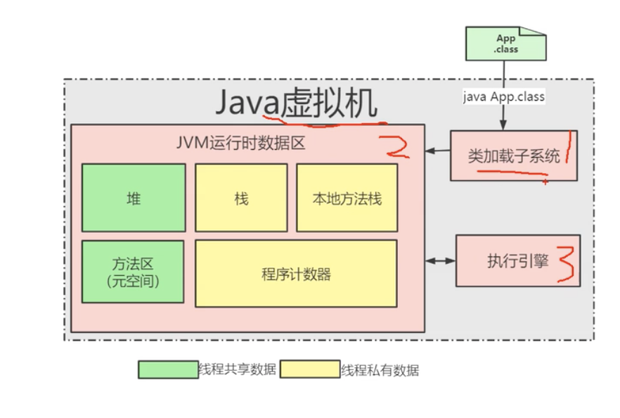

#                                                    面经


## java基础

[面试题](https://blog.csdn.net/u012456528/article/details/79759487)

### 构造器调用顺序

子类构造器调用super方法一定只能在第一句，因为子类初始化，先调用父类构造器，在调用子类构造器。

子类如何调用父类的方法呢：子类里面存在一个super对象，指向父对象。

### static的使用场景：

1. 修饰成员变量，成员方法。只有在调用这个类的方法或属性的时候，才会触发静态代码块。
2. 静态代码块：静态代码块定义在类中方法外2.静态代码块的格式是 static { 语句体; }3.它优先于主方法执行、优先于构造代码块执行，当以任意形式第一次使用到该类时执行4.该类不管创建多少对象，静态代码块只执行一次
3. 静态内部类：普通类是不允许声明为静态的，只有内部类才可以被static修饰的内部类可以直接作为一个普通类来使用，而不需实例一个外部类
4. 静态倒入包，import static java.lang.Math.*;可直接使用Math下的所有静态资源（包括方法，属性），不需要通过类来使用，直接max(2, 3)。

### 多态

多态性是面向对象编程的又一个重要特征，它是指在父类中定义的属性和方法被子类继承之后，可以具有不同的数据类型或表现出不同的行为，这使得同一个属性或方法在父类及其各个子类中具有不同的含义。

对面向对象来说，多态分为编译时多态和运行时多态。其中**编译时多态是静态的，主要是指方法的重载**，它是根据参数列表的不同来区分不同的方法。**通过编译之后会变成两个不同的方法**，在运行时谈不上多态。而运行时多态是动态的，它是通过动态绑定来实现的，也就是大家通常所说的多态性。

Java实现多态有 3 个必要条件：**继承、重写和向上转型**。只有满足这 3 个条件，开发人员才能够在同一个继承结构中使用统一的逻辑实现代码处理不同的对象，从而执行不同的行为。

- 继承：在多态中必须存在有继承关系的子类和父类。
- 重写：子类对父类中某些方法进行重新定义，在调用这些方法时就会调用子类的方法。
- 向上转型：在多态中需要将子类的引用赋给父类对象，只有这样该引用才既能可以调用父类的方法，又能调用子类的方法。

### 泛型

不同的类型的泛型类之间不能赋值，泛型只能包含引用内型。接口中的属性不能使用泛型，因为接口的属性默认是static，final类型的，但是方法可以使用泛型。

提高代码的重用性， 避免重载；

避免类型转换异常，提高代码的安全性。

**泛型**：就是将类型由原来的具体的类型参数化，类似于方法中的变量参数，此时类型也定义成参数形式（可以称之为类型形 参），然后在使用/调用时传入具体的类型（类型实参）。在使用的时候确定他的类型。

**原理**：在编译后的字节码文件中，就已经替换为原来的原生类型（RawType，也称为裸类型）了，并且在相应的地方插入了强制转型代码，因此，对于运行期的 Java 语言来说，ArrayList＜Integer＞与 ArrayList＜String＞就是同一 个类，所以泛型技术实际上是 Java 语言的一颗语法糖，Java 语言中的泛型实现方法称为类型擦除，基于这种方法实现的泛型称为伪泛型。

### String常用方法


### floor，ceil，around

floor函数是向下取整函数，用来得到不大于一个数的最大整数；

ceil函数是向上取整函数，用来得到不小于一个数的最小整数；

round函数是四舍五入函数：floor(x+0.5)。

### 创建对象的方式

1. new，走构造器

2. ```java
   类名.class.getConstructor().newInstance();
   test.class.getDeclaredConstructor(String.class).newInstance("你好"); // String.class 表示构造函数传入的参数类型
   String h = String.class.getConstructor(String.class).newInstance("hahaha");
   
   ```

3. ```java
   (类名) 对象.clone();
   ```

4. ```java
   序列化与反序列化
    @Test
       public void serialized() throws IOException { //序列化
           ApplicationContext applicationContext = new AnnotationConfigApplicationContext(SpringConfig.class);
           serializePeople people = applicationContext.getBean("serializePeople", serializePeople.class);
           people.setAge(100);
           people.setName("lzx boss");
           ObjectOutputStream o = new ObjectOutputStream(new FileOutputStream("people.txt"));
           o.writeObject(people);
           o.close();
       }
       @Test
       public void reserialize() throws IOException, ClassNotFoundException { //反序列化
           ObjectInputStream in = new ObjectInputStream(new FileInputStream("people.txt"));
           serializePeople people1 = (serializePeople) in.readObject();
           System.out.println(people1.toString());
   
           in.close();
       }
   
   当反序列化时，对象class文件修改后会出错。
   ```

反射：反射就是把Java的各种成分映射成相应的Java类。

```java
Constructor[] c = test.class.getDeclaredConstructors(); // 获得所有的构造器
for(int i = 0; i < c.length; i++){
    System.out.println((Modifier.toString(c[i].getModifiers())));
    Class[]  cla = c[i].getParameterTypes(); // 获得每一个构造器的参数类型
    for(int j =0; j< cla.length; j++){
        System.out.print(cla[j] + " ");
    }
    System.out.println();
}

Method[] M = c.getDeclaredMethods();
Constructor[] C = c.getConstructors();

```

### final 关键字主要用在哪些地方？

final表示常量，final有三种使用场景，分别是修饰变量、方法和类，无论哪种修饰，一旦声明为final类型，你将不能改变这个引用了

- 修饰变量：比如pi
- 修饰方法：当一个方法被final修饰后，表示该方法不能被子类重写，final方法有一个好处是比非final方法要快
- 修饰类：当一个类被final修饰后，表示该类是完整的，不能被继承，例如Java中String、Integer类都是final类 

### 重载和重写的区别

重写方法的参数列表必须完全与被重写的方法的相同，返回值必须和被重写的方法的返回一致

### NIO

三个核心组件：Buffer，channel，selector

传统的IO：单向（输入，输出流），面向流。

new IO：程序与磁盘文件的双向传输（读，写），称为通道（铁路）传输。通过Buffer（火车）传输数据。


- channel负责连接

- buffer

  负责传输（存取，底层数组。用于存储不同数据类型的数据）；

  根据类型的不同，提供了不同类型的缓冲区，除了boolean

  存在：ByteBuffer,CharBuffer,ShortBuffer,IntBuffer,LongBuffer,DoubleBuffer,FloatBuffer


#### 缓冲区的四个核心属性

capacity, position, limit,mark.

```java
public class TestBuffer {
    //1 分配一个缓冲区
    ByteBuffer buffer = null;
    ByteBuffer buffer2 = null;
    public TestBuffer(int capacity){
        buffer = ByteBuffer.allocate(capacity);
        buffer2 = ByteBuffer.allocate(capacity);
    }

    public void find(){
        System.out.println(buffer.position());
        System.out.println(buffer.limit());
        System.out.println(buffer.capacity());
    }

    public void test1(){
        find(); // 0,1024,1024
        String name = "lzx";
        //  利用put写入buffer
        buffer.put(name.getBytes());
        find(); // 3,1024,1024
        // 切换到读模式
        buffer.flip();
        find(); // 0, 3, 1024
        byte[] dst = new byte[buffer.limit()];
        buffer.get(dst);  // 读取到byte数组中
        System.out.println(new String(dst));
        find();// 3, 3, 1024
        //重复读
        buffer.rewind(); //0 3 1024
        find();
        //clear，清空缓冲区，数据已然改变，只是将position,limit恢复到初始状态
        buffer.clear(); // 0, 1024, 1024
        find();

    }

    public void test2(){
        // 通过mark记录position，limit，reset恢复到mark的状态
        String name = "abcdefghijklmnopqrstuvwxyz";
        buffer2.put(name.getBytes());
        byte[] res = new byte[buffer2.limit()];
        buffer2.flip();
        buffer2.get(res, 0, 2);
        System.out.println(buffer2.position());
        buffer2.mark();
        buffer2.get(res, 2, 4);
        System.out.println(buffer2.position());
        buffer2.reset();
        System.out.println(buffer2.position());
    }
```

### 接口和抽象类的区别：

接口：属性默认是public static final，接口只是描述应该具备的方法，没有具体的实现，不能实例化。

比如接口定义了一个

```java
StringBuilder a = new StringBuilder("asds"); // 则实现了implements的类可以访问他，但是不可以a = .....,但是可以调用a的成员方法，如a.append("aa")。
```

他们的共同点如下：

1. 都是上层的抽象层。
2. 都不能被实例化
3. 都能包含抽象的方法，这些抽象的方法用于描述类具备的功能，但是不比提供具体的实现。

他们的区别如下：

1. 在抽象类中可以写非抽象的方法，从而避免在子类中重复书写他们，这样可以提高代码的复用性，这是抽象类的优势；接口中只能有抽象的方法。
2. 一个类只能继承一个直接父类，这个父类可以是具体的类也可是抽象类；但是一个类可以实现多个接口。
3. 接口只能继承另一个接口，抽象类既可以实现一个接口也可以继承接口

### 四种引用类型：

1. 强引用：Java中默认声明的就是强引用，强引用的对象是不被GC的，哪怕报错OOM
2. 软引用：用java.lang.ref.SoftReference类来表示软引用，当内存不足时，可以回收软引用的对象，从而避免OOM
3. 弱引用：java.lang.ref.WeakReference 来表示弱引用，只要调用System.gc()，不管内存是否足够，都会回收所有的弱引用对象。
4. 虚引用和引用对列：虚引用是最弱的一种引用关系，如果一个对象仅持有虚引用，那么它就和没有任何引用一样，它随时可能会被回收。通过查看这个类的源码，发现它只有一个构造函数和一个 get() 方法，而且它的 get() 方法仅仅是返回一个null，也就是说将永远无法通过虚引用来获取对象，虚引用必须要和 ReferenceQueue 引用队列一起使用。虚引用必须和引用队列关联使用，当垃圾回收器准备回收一个对象时，如果发现它还有虚引用，就会把这个虚引用加入到与之 关联的引用队列中。程序可以通过判断引用队列中是否已经加入了虚引用，来了解被引用的对象是否将要被垃圾回收。如果程序发现某个虚引用已经被加入到引用队列，那么就可以在所引用的对象的内存被回收之前采取必要的行动。

#### 软引用:

```java
List<SoftReference<byte[]>>  list = new ArrayList<>();
for(int i = 0 ; i < 10000; i++){
    byte[] t = new byte[1024 * 1024];
    SoftReference<byte[]> ar = new SoftReference<>(t);
    list.add(ar);
}
for(SoftReference s : list){
    System.out.println(s.get());
}
```


## 容器

常见问题：调用remove方法或者contains方法时，必须删除添加的哪个对象，如果想根据对象属性相同来进行删除的话，必须重写对象的equals方法。

### 如何确保集合元素不被修改

（1）通过 Collections. unmodifiableCollection(Collection c)
（2）通过Arrays.asList创建的集合

### 集合和数组的区别：

集合是一个对象的容器，定一个对多个对象的操作方法，可以实现数组的功能，与数组不一样的是，集合大小是不固定的。数组可以存储基本数据内型和对象，但是集合只能存储对象，可以通过自动装箱完成对基本数据内型的存储。

### 常用方法：

Add, addAll, remove,removeAll,contain, retainAll,isEmpty,clear,toArray。

### 遍历集合的方式：

1. 增强for

```java
for(Object o:collection){
    System.out.println(o);
}
```

2. iterator

使用迭代器，不允许删除collection里面的元素，但是可以调用迭代器的方法删除。

3. ListIterator

Iterator接口提供了很多对集合元素进行迭代的方法。每一个集合类都包含了可以返回迭代器实例的迭代方法。迭代器可以在迭代的过程中删除底层集合的元素,但是不可以直接调用集合的 remove(Object Obj)删除，可以通过迭代器的remove()方法删除。

#### Iterator和ListIterator的区别是什么:

1. Iterator可以遍历set和list集合，但是ListIterator只能用来遍历List
2. Iterator对集合只能是前向遍历，ListIterator既可以前向也可以后向。
3. ListIterator实现了Iterator接口，并包含其他的功能，比如：增加元素(add)，替换元素(set)，获取前一个和后一个元素的索引。

### Enumeration, Iterator

Enumeration速度是Iterator的2倍，同时占用更少的内存。但是，Iterator远远比Enumeration安全，因为其他线程不能够修改正在被iterator遍历的集合里面的对象。同时，Iterator允许调用者删除底层集合里面的元素，这对Enumeration来说是不可能的。

#### Comparable和Comparator接口的区别。

如果在定义类时，就实现了Comparable接口，直接在里面重写compareTo()方法，如果没实现，后面在业务开发中需要有比较排序的功能，就再单独写一个类实现Comparator接口，在里面重写compare()方法，然后这个类需要作为参数传入到工具类Collections.sort和Arrays.sort方法中

### ArrayList

数据存储

1. ```java
   transient Object[] elementData;  // transient关键字，序列化时不会将该变量的数据写到磁盘文件中。
   ```

2. ```java
   private static final int DEFAULT_CAPACITY = 10; // 初始大小
   ```

### Set

#### HashSet里面添加对象

需要重写hashcode和equals，首先通过hashcode找到位置，如果存在对象，然后在通过equals判断。

#### hashCode（）与 equals（）的相关规定

1. 如果两个对象相等，则hashcode必须相等。
2. 如果两个对象相等，对其中的一个对象调用equals()必须返回true,也就是说a .equals(b),则 b.equals(a).
3. 如果两个对象有相同的hashCode值，他们也不一定相等。但若两个对象相等，则hashcode值一定相等。
4. 因此若equals()被覆盖过，则hashcode（）也必须被覆盖。
5. hashCode()的默认行为实在对heap上的对象产生独特的值。如果没有override过hashCode()，则该class的两个对象怎么都不会被认为是相同的。
6. equals()的默认行为是执行==的比较。也就是说会去测试两个引用是否对上heap上同一个对象。如果equals()没有被覆盖过，两个对象永远都不会被视为相同的。因此不同的对象有不同的字节组合。

- equal()相等的两个对象他们的hashCode()肯定相等，也就是用equal()对比是绝对可靠的。
- hashCode()相等的两个对象他们的equal()不一定相等，也就是hashCode()不是绝对可靠的。

​    所有对于需要大量并且快速的对比的话如果都用equal()去做显然效率太低，**所以解决方式是，每当需要对比的时候，首先用hashCode()去对比，如果hashCode()不一样，则表示这两个对象肯定不相等（也就是不必再用equal()去再对比了）,如果hashCode()相同，此时再对比他们的equal()，如果equal()也相同，则表示这两个对象是真的相同了，这样既能大大提高了效率也保证了对比的绝对正确性！**

#### 重写hashacode的技巧：

一般重写hashcode都计算result = 31*result + property.hashcode。其中31*i = (i<<5) - 1。

#### TreeSet：

treeset添加的对象需要实现comparable接口，重写compareTo方法，调用contain以及remove方法时，是根据compareTo进行比较的，这与HashSet不一样的。也可以通过Comparator实现这个比较功能。

### Map

无序；键值不能重复，否则后面的会将前面相同的键值替换；

默认初始容量：16 = 1<<4

最大容量：1<< 30

扩容因子：0.75

#### 遍历方式

1. ```java
   for(String s:map.keySet()){
       System.out.println(map.get(s));
   }
   ```

2. ```java
   for(Map.Entry<String, String> entry:map.entrySet()){
       System.out.println(entry.getValue());
   }
   ```

#### HashMap里面添加对象：

类似于HashSet，需要重写HashCode方法和Equals方法。


jdk1.8尾插入能够保证元素顺序，避免扩容的时候出现回路。1.8之前是头插入，可以保证后插入的数据的优先查找。

### hashmap扩容因子为什么是0.75

 **提高空间利用率和 减少查询成本的折中**。过大，容易碰撞，查询成本高，过小，碰撞几率小，但是浪费空间。

### 为什么Hash扩容为2倍

```java
(first = tab[(n - 1) & hash]) != null) //找到first节点
```

```java
int index = (e.hash & 0x7FFFFFFF) //hashTable计算索引
```

### 谈谈hashMap：

​		初始容量，扩容因子，如何查找一个entry，hashcode，equals，是否允许key相同，是否允许key为null，为什么是2倍扩容，为什么扩容因子是0.75，为什么不是线程安全的，为什么要尾插入，而不是头插入，头插入有什么缺点和优点，1.7，1.8的区别，何时转化为红黑树，为什么不是AVL。

### Collections

集合工具类:可以实现反转，排序，打乱，复制,折半查找。

```java
Integer[] a =  arr.toArray(new Integer[0]); // new Integer[0]只是为了指定类型，返回的a的容量是arr.size()和‘0’中的最大值
List<Integer> b = Arrays.asList(a); // 通过将Array转化为集合类对象时，该对象不能调用add和remove方法，因为数组的大小是固定的。
```

```java
int[] nums = {10, 20, 30};
List<int[]> a = Arrays.asList(nums); //list里面只有一个元素，就是整个int数组
// 如果想把基本数据类型数组转化为集合时，需要修改为包装内型
Integer[] nums = {10, 20, 30};
List<Integer> a = Arrays.asList(nums); // list里面只能存储引用对象，所以list中存在3个Integer类型的对象。
```

### ConcurrentHashMap和Hashmap，**HashTable**的区别

HashMap：底层数组+链表实现，可以存储null建和null值，线程不安全。

HashTable：底层数组+链表实现，无论key还是value都**不能为null**，线程**安全**，实现线程安全的方式是在修改数据时锁住整个HashTable，效率低

ConcurrentHashMap将map分段，通过分段锁来提供线程安全，同文同一个段时才会被锁住，因此可以提高速率，默认16倍。1.7使用的Reentrolock，1.8使用的Synchronize。

### java1.8 ConcurrentHashMap的变化

1. 采用红黑树，链表，数组
2. 弃用分段，采用synchronized

#### 弃用分段锁的原因

1. 加入多个分段锁浪费内存空间。
2. 生产环境中， map 在放入时竞争同一个锁的概率非常小，分段锁反而会造成更新等操作的长时间等待。
3. 为了提高 GC 的效率

#### 新的方案

如：put操作：

 首先通过 hash 找到对应链表过后， 查看当前插入是否是第一个object， 如果是， 直接用cas原则插入，无需加锁。

 如果不是链表第一个object， 则直接用链表第一个object加锁，这里加的锁是synchronized

#### 为什么是synchronized

1. 减少内存开销
2. 获得JVM的支持：synchronized随着jdk的升级进行了优化，引入了锁的升级，在少量线程下效率更好。

### 优先队列：

PriorityQueue是一个基于优先级堆的无界队列，PriorityQueue不允许null值， PriorityQueue不是线程安全的，入队和出队的时间复杂度是O(log(n))。

```java
//自定义比较器，降序排列
static Comparator<Integer> cmp = new Comparator<Integer>() {
      public int compare(Integer e1, Integer e2) {
        return e2 - e1;
      }
    };
Queue<Integer> qq = new PriorityQueue<>(cmp); //不掺入比较器按照升序排列，这个比较器是按照讲叙排列。
```

## 多线程

### threadlocal

threadlocal而是一个线程内部的存储类，通过一个Entry数组存储键值对，可以在指定线程内存储数据，数据存储以后，只有指定线程可以得到存储数据。

ThreadLocal和Synchronized都是为了解决多线程中相同变量的访问冲突问题，不同的点是

- Synchronized是通过线程等待，牺牲时间来解决访问冲突
- ThreadLocal是通过每个线程单独一份存储空间，牺牲空间来解决冲突，并且相比于Synchronized，ThreadLocal具有线程隔离的效果，只有在线程内才能获取到对应的值，线程外则不能访问到想要的值。

### 死锁

产生的条件：

1. 互斥条件：进程要求对所分配的资源进行排它性控制，即在一段时间内某资源仅为一进程所占用。
2. 请求和保持条件：当进程因请求资源而阻塞时，对已获得的资源保持不放。
3. 不剥夺条件：进程已获得的资源在未使用完之前，不能剥夺，只能在使用完时由自己释放。
4. 环路等待条件：在发生死锁时，必然存在一个进程--资源的环形链。

解决方法：

加锁顺序： 当多个线程需要相同的一些锁，但是按照不同的顺序加锁，死锁就很容易发生。如果能确保所有的线程都是按照相同的顺序获得锁，那么死锁就不会发生。当然这种方式需要你事先知道所有可能会用到的锁，然而总有些时候是无法预知的。
加锁时限： 加上一个超时时间，若一个线程没有在给定的时限内成功获得所有需要的锁，则会进行回退并释放所有已经获得的锁，然后等待一段随机的时间再重试。但是如果有非常多的线程同一时间去竞争同一批资源，就算有超时和回退机制，还是可能会导致这些线程重复地尝试但却始终得不到锁。
死锁检测： 死锁检测即每当一个线程获得了锁，会在线程和锁相关的数据结构中（map、graph等等）将其记下。除此之外，每当有线程请求锁，也需要记录在这个数据结构中。死锁检测是一个更好的死锁预防机制，它主要是针对那些不可能实现按序加锁并且锁超时也不可行的场景。

### synchronized的实现原理和应用总结

1. synchronized同步代码块：synchronized关键字经过编译之后，会在同步代码块前后分别形成monitorenter和monitorexit字节码指令，在执行monitorenter指令的时候，首先尝试获取对象的锁，如果这个锁没有被锁定或者当前线程已经拥有了那个对象的锁，锁的计数器就加1，在执行monitorexit指令时会将锁的计数器减1，当减为0的时候就释放锁。如果获取对象锁一直失败，那当前线程就要阻塞等待，直到对象锁被另一个线程释放为止。
2. 同步方法：方法级的同步是隐式的，无须通过字节码指令来控制，JVM可以从方法常量池的方法表结构中的ACC_SYNCHRONIZED访问标志得知一个方法是否声明为同步方法。当方法调用的时，调用指令会检查方法的ACC_SYNCHRONIZED访问标志是否被设置，如果设置了，执行线程就要求先持有monitor对象，然后才能执行方法，最后当方法执行完（无论是正常完成还是非正常完成）时释放monitor对象。在方法执行期间，执行线程持有了管程，其他线程都无法再次获取同一个管程。

### synchronized和lock的区别：

1.首先synchronized是java内置关键字，在jvm层面，Lock是个java类；

2.synchronized无法判断是否获取锁的状态，Lock可以判断是否获取到锁；

3.synchronized会自动释放锁(a 线程执行完同步代码会释放锁 ；b 线程执行过程中发生异常会释放锁)，Lock需在finally中手工释放锁（unlock()方法释放锁），否则容易造成线程死锁；

4.用synchronized关键字的两个线程1和线程2，如果当前线程1获得锁，线程2线程等待。如果线程1阻塞，线程2则会一直等待下去，而Lock锁就不一定会等待下去，如果尝试获取不到锁，线程可以不用一直等待就结束了；

5.synchronized的锁可重入、不可中断、非公平，而Lock锁可重入、可中断、可公平（两者皆可）

6.Lock锁适合大量同步的代码的同步问题，synchronized锁适合代码少量的同步问题。

### Thread.Sleep(0)的作用

Thread.Sleep(0)的作用，就是“触发操作系统立刻重新进行一次CPU竞争”。比如当前进程想放弃使用cpu，就只能通过sleep操作，告诉操作系统sleep时间内别找我。

### sleep和wait的区别

1. sleep是Thread的静态方法，wait是Object的方法，任何对象实例都能调用。
2. sleep不会释放锁，它也不需要占用锁。wait会释放锁，但调用它的前提是当前线程占有锁(即代码要在synchronized中)。
3. 它们都可以被interrupted方法中断。

### sleep()方法和yield()的区别

1. sleep()方法在给其他线程运行机会时不考虑线程的优先级。因此会给低优先级的线程运行的机会，而yield()方法只会给相同优先级或更高优先级的线程运行的机会。
2. 线程执行sleep()方法后会转入阻塞状态，所以执行sleep()方法的线程在指定的时间内肯定不会被执行，而yield()方法只是使当前线程重新回到就绪状态，所以执行yield()方法的线程有可能在进入到就绪状态后又立马被执行。

###  notify()和notifyAll()的区别

Object线程同步的相关方法：wait, notify,botifyAll.

**相同点**

1. notify()和notifyAll()都属于Object类中的方法
2. 都是将线程由等待池到锁池的调动，锁池中的线程会去竞争该对象的锁。

**不同点**：

1. notify()是在等待池中随机唤醒一个等待线程，调入锁池中。
2. notifyAll()是将处于等待池中全部的等待线程唤醒，调入锁池中通过线程之间竞争对象锁，等待执行

### Java线程状态

```java
// 为了节约空间，我删除了注释
public enum State {
       NEW,//初始状态
       RUNNABLE,//运行状态
       BLOCKED,// 阻塞状态
       WAITING,//等待状态
       TIMED_WAITING,//超时等待状态
       TERMINATED;//终止状态
 }
```

调用**start**方法方可启动线程，而**run**方法只是thread类中的一个普通方法调用，还是在主线程里执行。

一个线程的start方法只可以调用一次，因为每次调用start方法的时候都会判断threadStatus线程状态是否为初始状态。

```java
if (threadStatus != 0)
    throw new IllegalThreadStateException();
```

### volatile关键字

1. 保证了不同线程对该变量操作的内存可见性;
2. 禁止指令重排序

### java锁的种类

#### 公平锁/非公平锁

公平锁是指多个线程按照申请锁的顺序来获取锁。非公平锁是指多个线程获取锁的顺序并不是按照申请锁的顺序，有可能后申请的线程比先申请的线程优先获取锁。有可能，会造成优先级反转或者饥饿现象。对于Java `ReentrantLock`而言，通过构造函数指定该锁是否是公平锁，默认是非公平锁。非公平锁的优点在于吞吐量比公平锁大。对于`Synchronized`而言，也是一种非公平锁。由于其并不像`ReentrantLock`是通过AQS的来实现线程调度，所以并没有任何办法使其变成公平锁。

#### 可重入锁

可重入锁又名递归锁，是指在同一个线程在外层方法获取锁的时候，在进入内层方法会自动获取锁。说的有点抽象，下面会有一个代码的示例。对于Java `ReentrantLock`而言, 他的名字就可以看出是一个可重入锁，其名字是`Re entrant Lock`重新进入锁。对于`Synchronized`而言,也是一个可重入锁。可重入锁的一个好处是可一定程度避免死锁。

```java
synchronized void setA() throws Exception{
    Thread.sleep(1000);
    setB();
}

synchronized void setB() throws Exception{
    Thread.sleep(1000);
}
```

#### 独享锁/共享锁

独享锁是指该锁一次只能被一个线程所持有。共享锁是指该锁可被多个线程所持有。

对于Java `ReentrantLock`而言，其是独享锁。但是对于Lock的另一个实现类`ReadWriteLock`，其读锁是共享锁，其写锁是独享锁。
读锁的共享锁可保证并发读是非常高效的，读写，写读 ，写写的过程是互斥的。独享锁与共享锁也是通过AQS来实现的，通过实现不同的方法，来实现独享或者共享。对于`Synchronized`而言，当然是独享锁。

#### 乐观锁/悲观锁

#### 分段锁

分段锁其实是一种锁的设计，并不是具体的一种锁，对于`ConcurrentHashMap`而言，其并发的实现就是通过分段锁的形式来实现高效的并发操作。
我们以`ConcurrentHashMap`来说一下分段锁的含义以及设计思想，`ConcurrentHashMap`中的分段锁称为Segment，它即类似于HashMap（JDK7与JDK8中HashMap的实现）的结构，即内部拥有一个Entry数组，数组中的每个元素又是一个链表；同时又是一个ReentrantLock（Segment继承了ReentrantLock)。
当需要put元素的时候，并不是对整个hashmap进行加锁，而是先通过hashcode来知道他要放在那一个分段中，然后对这个分段进行加锁，所以当多线程put的时候，只要不是放在一个分段中，就实现了真正的并行的插入。

#### 偏向锁/轻量级锁/重量级锁

这三种锁是指锁的状态，并且是针对`Synchronized`。在Java 5通过引入锁升级的机制来实现高效`Synchronized`。这三种锁的状态是通过对象监视器在对象头中的字段来表明的。
偏向锁是指一段同步代码一直被一个线程所访问，那么该线程会自动获取锁。降低获取锁的代价。
轻量级锁是指当锁是偏向锁的时候，被另一个线程所访问，偏向锁就会升级为轻量级锁，其他线程会通过自旋的形式尝试获取锁，不会阻塞，提高性能。
重量级锁是指当锁为轻量级锁的时候，另一个线程虽然是自旋，但自旋不会一直持续下去，当自旋一定次数的时候，还没有获取到锁，就会进入阻塞，该锁膨胀为重量级锁。重量级锁会让其他申请的线程进入阻塞，性能降低。

#### 自旋锁

在Java中，自旋锁是指尝试获取锁的线程不会立即阻塞，而是采用循环的方式去尝试获取锁，这样的好处是减少线程上下文切换的消耗，缺点是循环会消耗CPU。

### JUC包

#### 原子性

一个操作是不可中断的，要么全部执行成功，要么全部执行失败。比如读取操作、赋值操作，赋值还只能是常数值，否则会多一步读取操作。

atomic包是java.util.concurrent下的一个专门为线程安全设计的java包，该包下包含多个原子操作类:

atomic包下相对常用的类有:AtomicInteger、AtomicIntegerArray、AtomicBoolean、AtomicLong、AtomicLongArray。

```java
 static int count = 0;

    public void thredInteger() throws InterruptedException {
        // 打印10次
        Object object  = new Object();
        for (int j = 0; j < 10; j++) {
            count = 0;
            // 10个线程
            for (int i = 0; i < 10; i++) {
                new Thread() {
                    @Override
                    public void run() {
                        // 每个线程自增1000次
                        for(int k = 0; k < 1000; k++){
                            synchronized (object){  // 加一个锁，我不执行完，谁也别想进来
                                count++;
                            }
                          //atomicInteger.getAndIncrement();或者调用这个类，保证++操作的原子性
                        }
                    }
                }.start();
            }
            Thread.sleep(1000);
            System.out.println("count: " + count);
        }
    }
```

#### CountDownLatch和CyclicBarrier


### AQS（抽象队列同步器）

java并发编程的核心

state：private volatile int

操作：

**抢锁**：getSate()，看锁是否被占用，未被占用（0），占用锁setState()，改标识位State=1。

CSA抢锁机制：使用CAS在线程冲突严重时，会大幅降低程序性能；CAS只适合于线程冲突较少的情况使用。

重入：获得锁的线程再次抢锁，state+1，从而释放state次。

公平锁与非公平锁：

```java
//非公平锁获取锁的流程
int c = getState();
if (c == 0) {  //先判断锁的状态
    if (compareAndSetState(0, acquires)) {  // CAS抢锁
        setExclusiveOwnerThread(current);
        return true;
    }
}
else if (current == getExclusiveOwnerThread()) { // 锁的持有者是否是自身
    int nextc = c + acquires;
    if (nextc < 0) // overflow
        throw new Error("Maximum lock count exceeded");
    setState(nextc);
    return true;
}
return false; // 否则返回false
```

1. 释放锁
2. 入队
3. 出队
4. 阻塞
5. 唤醒

### 公平锁与非公平锁：

公平锁，每次判断锁是否释放，并且判断对列是否为空，是，则获得，否则排队。

非公平锁：直接判断锁是否释放，释放直接获取，否则入队

### 线程之间是如何通信的

1. 同步：**这种方式，本质上就是“共享内存”式的通信。多个线程需要访问同一个共享变量，谁拿到了锁（获得了访问权限），谁就可以执行**。Java中每一个对象都可以成为一个监视器`(Monitor)`, 该Monitor由一个锁`(lock)`, 一个等待对列，
2. while轮询，询问的对象是volatile标记的。
3. thread.join()，在某个线程中执行这个方法，该线程会刮起，直至thread这个线程执行完毕。
4. condition，Lock,await,signal,signalAll，await会阻塞当前线程，并且释放锁，在释放的过程中会唤醒同步队列中的下一个节点，每一个condition就是一个阻塞对列，每次都是通过condition调用awaite和signal方法。

```java
//资源类
class MyList {

    //临界资源
    private volatile List<String> list = new ArrayList<String>();

    public void add() {
        list.add("abc");
    }

    public int size() {
        return list.size();
    }
}

// 线程A
class ThreadA extends Thread {

    private MyList list;

    public ThreadA(MyList list,String name) {
        super(name);
        this.list = list;
    }

    @Override
    public void run() {
        try {
            for (int i = 0; i < 3; i++) {
                list.add();
                System.out.println("添加了" + (i + 1) + "个元素");
                Thread.sleep(1000);
            }
        } catch (InterruptedException e) {
            e.printStackTrace();
        }
    }
}

//线程B
class ThreadB extends Thread {

    private MyList list;

    public ThreadB(MyList list,String name) {
        super(name);
        this.list = list;
    }

    @Override
    public void run() {
        try {
            while (true) {          // while 语句轮询
                if (list.size() == 2) {
                    System.out.println("==2了，线程b要退出了！");
                    throw new InterruptedException();
                }
            }
        } catch (InterruptedException e) {
            e.printStackTrace();
        }
    }
}
```

   

```java
public class test3 {
    private ReentrantLock lock = new ReentrantLock();
    private Condition condition1 = lock.newCondition(); //一个condition管理一个阻塞对列
    private Condition condition2 = lock.newCondition();

    public void awaitA() throws InterruptedException {
        lock.lock();
        System.out.println("通过condition1来阻塞");
        condition1.await();  //通过condition调用await和signal，signalAll方法
        System.out.println("condition1被释放");
        lock.unlock();
    }

    public void awaitB() throws InterruptedException {
        lock.lock();
        System.out.println("通过condition2来阻塞");
        condition2.await();
        System.out.println("condition2被释放了");
        lock.unlock();
    }

    public void release_A(){
        lock.lock();
        condition1.signalAll();
        lock.unlock();

    }

    public void realese_B(){
        lock.lock();
        condition2.signal();
        lock.unlock();
    }


    public static void main(String[] args) throws InterruptedException {
        test3 t = new test3();
        Thread5 t5 = new Thread5(t);
        Thread6 t6 = new Thread6(t);
        Thread5 t7 = new Thread5(t);
        t6.start();
//        Thread.sleep(100);
        t5.start();
        t7.start();
        Thread.sleep(100);
        t.realese_B();
//        t.release_A();
    }

}

class Thread5 extends Thread{
    test3 t;

    public Thread5(test3 t) {
        this.t = t;
    }

    @SneakyThrows
    public void run(){
        t.awaitA();
    }
}

class Thread6 extends Thread{

    test3 t;

    public Thread6(test3 t) {
        this.t = t;
    }

    @SneakyThrows
    public void run(){
        t.awaitB();
    }
}
```

5. waite/notify机制：

### 线程池

核心参数：

int corePoolSize： 线程池长期维持的线程数，核心线程会一直存活（即使没有任务需要执行）
int maximumPoolSize： 最大线程数，线程池中能够创建的线程的最大数量。
		当线程数>=corePoolSize，且任务队列已满时。线程池会创建新线程来处理任务
		当线程数=maximumPoolSize，且任务队列已满时，线程池会拒绝处理任务而抛出异常
long keepAliveTime, TimeUnit unit：超过corePoolSize的线程的存活时长，超过这个时间，多余的线程会被回收。
BlockingQueue< Runnable> workQueue： 任务的阻塞队列
ThreadFactory threadFactory, // 新线程的产生方式
RejectedExecutionHandler handler： 任务队列满时，新任务到达后采用的拒绝策略。

```java
ExecutorService service1 = Executors.newCachedThreadPool(); //全部是非核心线程，任务并发多是会造成cpu的大量使用
ExecutorService service2 = Executors.newFixedThreadPool(10); // 全部都是核心线程，且数量为10（传入的参数），大量并发任务可能会造成oom
ExecutorService service3 = Executors.newSingleThreadExecutor();//只有一个核心线程，大量并发任务可能会造成oom
//前面三个是通过ThreadPoolExecutor的重载实现的，无非就是线程池的核心参数不同而已。

ThreadPoolExecutor myservice = new ThreadPoolExecutor(10, 20, 0L, TimeUnit.MILLISECONDS, new LinkedBlockingQueue<Runnable>(10)); // 自定义一个线程池，自己定义核心线程数，总的线程数，对列的容量，当提交第31个任务时会报错
```


执行过程：

1. 核心线程小于coresize：创建一个核心线程t（Worker接口Runnable），调用t.start开启核心线程，执行Worker类的run方法，run方法里面执行RunWoker方法，RunWorker方法里面调用用户的task的run方法，实际上，用户task只是接口了Runnale方法，重写了run方法，并没有开启一个新的线程。

   ```java
    while (task != null || (task = getTask()) != null)  //通过该判断语句做如下判断：当前task不为空，执行当前task，执行完赋值null，如果当前task为null，通过getTask方法获得阻塞对列的下一个task，如果也为空，则结束。
   ```

   因此，只要开启了一个线程池，核心线程就会一直存在，一直解决task。

2. 核心线程满了，则放入阻塞对列

3. 对列满了，则创建一个非核心线程解决，同样也是通过上述机制解决对列中的任务，过程和1相同，只是addWorker方法传入的参数core=false。

4. 线程数量超过了最大的线程数，且对列满了，通过拒绝解决。

   ```java
   if (workerCountOf(c) >= ((core ? corePoolSize : maximumPoolSize) & COUNT_MASK))
       return false;   //这部分代码在addWorker方法里面，判断是否超过最大线程数量
   ```

5. 如何利用keepAliveTime释放掉超时的非核心线程呢。

```java
private final HashSet<Worker> workers = new HashSet<>(); //通过一个HashSet来管理所有的线程
/*在getTask方法里面有一个时间判断，超过了时间，为从对列中取出任务，则返回空，则笔记1中的while结束，
执行RunWorker方法的最后一行代码processWorkerExit方法, 通过workers.remove(w);删除该线程。通过设置allowCoreThreadTimeOut来控制是否销毁核心线程。
*/
```

#### 线程池中 submit() 和 execute()方法有什么区别？

execute() 参数 Runnable ；submit() 参数 (Runnable) 或 (Runnable 和 结果 T) 或 (Callable)。
execute() 没有返回值；而 submit() 有返回值。
submit() 的返回值 Future 调用get方法时，可以捕获处理异常。

```java
public static void main(String[] args) throws ExecutionException, InterruptedException {
    ExecutorService ex = Executors.newSingleThreadExecutor();
    CallTask c = new CallTask();
    System.out.println(ex.submit(c).get());  //通过线程池，Future来执行Callable任务

    FutureTask<Integer> fu = new FutureTask<>(c); // 通过新建一个线程，以及FustureTask来执行Callable任务
    Thread t = new Thread(fu);
    t.start();
    System.out.println(fu.get());
    ex.shutdown();
  // 都是通过get方法获得返回值，且必须执行完才会继续执行主线程。
  //FutureTask实现了Future和Runnable接口，因此可以通过创建一个线程来运行，Thread的构造器的参数只能是无参和Runnable，不能是Callable。
}
```

### 线程类型：

1. 用户线程ULT
2. 内核线程KLT。

JavaJVM里面使用的线程模型为KLT。


### 线程同步

线程同步：即当有一个线程在对内存进行操作时，其他线程都不可以对这个内存地址进行操作，直到该线程完成操作， 其他线程才能对该内存地址进行操作，而其他线程又处于等待状态。

#### 1. 使用synchronized关键字

由于java的每个对象都有一个内置锁，当用此关键字修饰方法时， 内置锁会保护整个方法。在调用该方法前，需要获得内置锁，否则就处于阻塞状态。

#### 2. wait和notify

#### 3. 使用特殊域变量volatile实现线程同步

不能保证原子性，它的原理是每次要线程要访问volatile修饰的变量时都是从内存中读取，而不是从缓存当中读取，因此每个线程访问到的变量值都是一样的。这样就保证了同步。

#### 4. 使用原子变量实现线程同步

在JUC包下存在atomic包下相对常用的类有:AtomicInteger、AtomicIntegerArray、AtomicBoolean、AtomicLong、AtomicLongArray

#### 5. 使用局部变量

#### 6. 使用重入锁实现线程同步

ReentrantLock类是可重入、互斥、实现了Lock接口的锁，它与使用synchronized方法和快具有相同的基本行为和语义，并且扩展了其能力。

#### 用户线程和守护线程：

守护线程是依赖于用户线程，用户线程退出了，守护线程也就会退出，典型的守护线程如垃圾回收线程。

用户线程是独立存在的，不会因为其他用户线程退出而退出。

### 线程中怎么处理不可捕捉异常：

1. 在run方法内部捕获

2. ```java
   public class WitchCaughtThread
   {
   	public static void main(String args[])
   	{
   		Thread thread = new Thread(new Task());
   		thread.setUncaughtExceptionHandler(new ExceptionHandler());//通过UncaughtExceptionHandler来捕获，其中ExceptionHandler是UncaughtExceptionHandler的接口实现类，重写了uncaughtException
   		thread.start();
   	}
   }
    
   class ExceptionHandler implements UncaughtExceptionHandler
   {
   	@Override
   	public void uncaughtException(Thread t, Throwable e)
   	{
   		System.out.println("==Exception: "+e.getMessage());
   	}
   
   ```

**阻塞式方法**是指程序会一直等待该方法完成，期间不做其他事情，如：lock，wait，await，acquire等等方法。

**Immutable**类意味着一旦创建了一个对象，我们就无法改变它的内容。在Java的中，所有包装类（如字符串，布尔值，字节，短）和字符串类都是不可变的，我们也可以创建自己的不可变类。Immutable对象可以在没有同步的情况下共享，降低了对该对象进行并发访问时的同步化开销。

### 什么叫java内存模型

JMM主要是为了规定了线程和内存之间的一些关系。根据JMM的设计，系统存在一个主内存(Main Memory)，Java中所有变量都储存在主存中，对于所有线程都是共享的。每条线程都有自己的工作内存(Working Memory)，工作内存中保存的是主存中某些变量的拷贝，线程对所有变量的操作都是在工作内存中进行，线程之间无法相互直接访问，变量传递均需要通过主存完成。

解决的问题：在多线程并发过程中，处理多线程读同步问题与可见性（多线程缓存与指令重排序）、多线程写同步问题与原子性：

1. **可见性（共享对象可见性）**：线程对共享变量修改的可见性。当一个线程修改了共享变量的值，其他线程能够立刻得知这个修改

### 生产者消费者模型

Semaphore实现：

```java
class KfcShelf {
    /**
     * 消费者许可
     */
    Semaphore consumerPermitCount = new Semaphore(0);

    /**
     * 生产者最多可以获取10个许可
     */
    Semaphore producerPermitCount = new Semaphore(10);

    /**
     * 许可证数量为1、相当于普通的锁
     */
    Semaphore isUse = new Semaphore(1);

    /**
     * 充当货架角色。注意：LinkedList是线程不安全的
     */
    LinkedList<Integer> shelfList = new LinkedList<>();

    public static void main(String[] args) {
        KfcShelf kfcShelf = new KfcShelf();
        // 生产者生产11个汉堡，前10个汉堡可以放在货架上，第11个生产者需要等待
        List<Thread> producerThreadList = new ArrayList<>();
        for (int i = 0; i < 11; i++) {
            Thread producer = new Thread(new Producer(kfcShelf));
            producer.start();
            producerThreadList.add(producer);
        }

        try {
            Thread.sleep(1_000);
            // 等待消费者前来消费
            System.out.println("生产10个汉堡，第11个生产者WAITING。等待消费者前来消费");
            System.out.println("生产者线程状态打印：\n" + producerThreadList.stream().map(thread -> String.format("%s:%s\n", thread.getName(), thread.getState())).collect(Collectors.joining()));
        }
        catch (InterruptedException e) {
            e.printStackTrace();
        }

        List<Thread> consumerThreadList = new ArrayList<>();
        // 消费者消费掉12个汉堡，第12个等待
        for (int i = 0; i < 12; i++) {
            Thread consumer = new Thread(new Consumer(kfcShelf));
            consumer.start();
            consumerThreadList.add(consumer);
        }

        try {
            Thread.sleep(1_000);
            // 等待消费者前来消费
            System.out.println("消费者购买汉堡");
            System.out.println("消费者线程状态打印：\n" +  consumerThreadList.stream().map(thread -> String.format("%s:%s\n", thread.getName(), thread.getState())).collect(Collectors.joining()));
        }
        catch (InterruptedException e) {
            e.printStackTrace();
        }


        try {
            Thread.sleep(1_000);
            // 等待生产者生产
            System.out.println("等待生产者生产第12个汉堡");
            System.out.println("======================");
        }
        catch (InterruptedException e) {
            e.printStackTrace();
        }
        // 生产者再生产一个汉堡，则消费者马上会消费掉
        Thread producer12 = new Thread(new Producer(kfcShelf));
        producer12.start();
    }

    /**
     * 往货架上放汉堡
     * @param hamburgerId
     */
    public void put(int hamburgerId) {
        try {
            // 生产者获取一个许可证
            producerPermitCount.acquire();
            isUse.acquire();
            shelfList.add(hamburgerId);
            System.out.println("生产:[汉堡-"+hamburgerId+"] 货架上的汉堡数量:["+shelfList.size()+"]");
        }
        catch (InterruptedException e) {
            e.printStackTrace();
        }
        finally {
            isUse.release();
            consumerPermitCount.release();
        }
        try {
            Thread.sleep(1000);
        }
        catch (InterruptedException e) {
            e.printStackTrace();
        }

    }// end method

    /**
     * 从货架上取一个汉堡
     * @return
     */
    public Integer take() {
        Integer hamburgerId = 0;
        try {
            consumerPermitCount.acquire();
            isUse.acquire();
            hamburgerId = shelfList.remove(0);
            System.out.println("消费:[汉堡-"+hamburgerId+"] 货架上的汉堡数量:["+shelfList.size()+"]");
        }
        catch (InterruptedException e) {
            e.printStackTrace();
        }
        finally {
            isUse.release();
            producerPermitCount.release();
        } return hamburgerId;
    }// end method
}// end class

class Producer implements Runnable {
    private KfcShelf kfcShelf;

    public Producer(KfcShelf KfcShelf) {
        this.kfcShelf = KfcShelf;
    }

    @Override
    public void run() {
        // 生成6位长度的随机数，当做条码编号
        int barCodeId = new Random().nextInt(100_000) + 100_000;
        kfcShelf.put(barCodeId);
    }
}// end class

class Consumer implements Runnable {
    private KfcShelf kfcShelf;

    public Consumer(KfcShelf KfcShelf) {
        this.kfcShelf = KfcShelf;
    }

    @Override
    public void run() {
        kfcShelf.take();
    }
}

/**
 * 汉堡实体
 */
@Data
class Hamburger {
    private Integer id;

    private Integer name;
}
```

### Runnable和Callable的区别

Runnable和Callable都代表那些要在不同的线程中执行的任务。Runnable从JDK1.0开始就有了，Callable是在JDK1.5增加的。它们的主要区别是Callable的 call() 方法可以返回值和抛出异常，而Runnable的run()方法没有这些功能。Callable可以返回装载有计算结果的Future对象。

```java
public class test implements Callable<Integer> { //返回类型


    public static void main(String[] args) {
        test t = new test();
        FutureTask<Integer> ft = new FutureTask<>(t);
        new Thread(ft).start();
        try {
            System.out.println(ft.get());
        }catch (Exception e){
            throw new RuntimeException();
        }

    }

    @Override
    public Integer call() throws Exception { //重写call方法
        int res = 0;
        for(int i = 0; i< 10;i++){
            res += i;
        }
        return res;  // 返回
    }
}
```

### Error 和Exception


### throw和throws的区别

throws是用来声明一个方法可能抛出的所有异常信息，throws是将异常声明但是不处理，而是将异常往上传，谁调用我就交给谁处理。而throw则是指抛出的一个具体的异常类型。

## JVM

Java虚拟机是一个可以执行Java字节码的虚拟机进程，Java源文件被编译成能被Java虚拟机执行的字节码文件。

[参考以下链接](https://www.cnblogs.com/it-deepinmind/p/12408911.html)

### Java跨平台

不同平台对应不同的JVM，因此同一份字节码class文件可以在不同平台执行，得到相同的结果。

Java是不同平台编译相同，不同时JRE。


c，c++，不同平台编译成不同的字节码，因此不是跨平台。


主线程执行代码

栈：存放方法，包含局部变量、操作数栈、方法出口、动态链接等等

程序计算器：记录当前的指令序号，它的作用可以看做是当前线程所执行的字节码的行号指示器。。

方法出口：记录返回出口。

堆：是Java虚拟机所管理的内存中最大的一块。Java堆是被所有线程共享的一块内存区域，在虚拟机启动时创建。此内存区域的唯一目的就是存放对象实例，几乎所有的对象实例都在这里分配内存，对象存储在heap上，因此需要一个引用（栈）指向堆上的对象（栈指向堆）

本地方法栈（native）：存储本地方法、操作

方法区：存储已被虚拟机加载的类信息、常量、静态变量、即时编译器编译后的代码等数据。

### 即时编译器和解释器

**解释编译器**：一条一条地读取，解释并且执行字节码指令，转化为机器码。因为它一条一条地解释和执行指令，所以它可以很快地解释字节码，但是执行起来会比较慢，没有JIT的配合下效率不高。

**JIT编译器模式**：即时编译器把整段字节码不加筛选的编译成机器码不论其执行频率是否有编译价值，存储在本地，加载慢，执行快。

一般来说采用混合模式，对于热点代码采用及时编译器

### 何时触发类的加载

1. 执行main函数的所在的类
2. 创建一个对象
3. 反射调用，序列化
4. 调用静态方法或者静态属性。
5. 初始化子类先初始化父类

### 如何定义自己的类加载器

1. 继承ClassLoader
2. 重写findClass方法

### static，final static，以及final何时赋值

static修饰的变量，准别阶段，被初始化为 默认值0 null ，初始化阶段赋值；

final：运行时被初始化，可以通过构造器赋值，初始化被赋值；

static final：只能直接赋值（不能再构造器赋值），访问类静态常量其实是直接访问常量池中的常量，不需要加载类

### 对象结构

Java对象由三个部分组成：对象头、实例数据、对齐填充。

对象头由两部分组成，第一部分存储对象自身的运行时数据：哈希码（调用hashCode才会显示hash值）、GC分代年龄、锁标识状态、线程持有的锁、偏向线程ID；第二部分是指针类型，指向对象的类元数据类型（类型指针）；

实例数据用来存储对象真正的有效信息（包括父类继承下来的和自己定义的

填充：保证8字节对齐。

### Java对象的定位方式

句柄池：java堆将会划分出来一部分内存去来作为句柄池，引用中存储的就是对象的句柄地址。而句柄中则包含对象实例数据的地址和对象类型数据在方法区的地址。

直接指针：直接指向堆上的对象。

### 如何判断一个对象是垃圾（可以回收）

- 引用计数：每个对象有一个引用计数属性，新增一个引用时计数加1，引用释放时计数减1，计数为0时可以回收。此方法简单，无法解决对象相互循环引用的问题。
- 可达性分析（Reachability Analysis）：从GC Roots开始向下搜索，搜索所走过的路径称为引用链。当一个对象到GC Roots没有任何引用链相连时，则证明此对象是不可用的，不可达对象。

### 回收方法区

方法区回收价值很低，主要回收废弃的常量和无用的类。

如何判断无用的类：

1.该类所有实例都被回收（Java堆中没有该类的对象）

2.加载该类的ClassLoader已经被回收

3.该类对应的java.lang.Class对象没有在任何地方被引用，无法在任何地方利用反射访问该类

### 对象在哪里产生

1. 新产生的对象优先进去Eden区，当Eden区满了之后再使用Survivor from，当Survivor from 也满了之后就进行Minor GC（新生代GC），将Eden和Survivor from中存活的对象copy进入Survivor to，然后清空Eden和Survivor from，这个时候原来的Survivor from成了新的Survivor to，原来的Survivor to成了新的Survivor from。复制的时候，如果Survivor to 无法容纳全部存活的对象，则根据老年代的分配担保（类似于银行的贷款担保）将对象copy进去老年代，如果老年代也无法容纳，则进行Full GC（老年代GC)。
2. 大对象直接进入老年代：JVM中有个参数配置-XX:PretenureSizeThreshold，令大于这个设置值的对象直接进入老年代，目的是为了避免在Eden和Survivor区之间发生大量的内存复制
3. 长期存活的对象进入老年代：JVM给每个对象定义一个对象年龄计数器，如果对象在Eden出生并经过第一次Minor GC后仍然存活，并且能被Survivor容纳，将被移入Survivor并且年龄设定为1。每熬过一次Minor GC，年龄就加1，当他的年龄到一定程度（默认为15岁，可以通过XX:MaxTenuringThreshold来设定），就会移入老年代。
4. 通过逃逸分析（没有被外部变量引用），对象可能在分配在栈中，不需要GC回收，直接通过栈就弹出。

### GC调优

​		目标：尽量减少FGC；转移到到老年代的对象尽可能少；尽量降低STW时间。

​		怎么做：参数控制。

尽量降低STW时间：选择一个合适的垃圾收集器，使用parNew，而不是seria，使用CMS或者G1并发标记。

​		对于 CMS 来说，我们要合理设置年轻代和年老代的大小。你可能会问该如何确定它们的大小呢？这是一个迭代的过程，可以先采用 JVM 的默认值，然后通过压测分析 GC 日志。
​		如果我们看年轻代的内存使用率处在高位，导致频繁的 Minor GC，而频繁 GC 的效率又不高，说明对象没那么快能被回收，这时年轻代可以适当调大一点。
​		如果我们看年老代的内存使用率处在高位，导致频繁的 Full GC，这样分两种情况：如果每次 Full GC 后年老代的内存占用率没有下来，可以怀疑是内存泄漏；如果 Full GC 后年老代的内存占用率下来了，说明不是内存泄漏，我们要考虑调大年老代。
​		对于 G1 收集器来说，我们可以适当调大 Java 堆，因为 G1 收集器采用了局部区域收集策略，单次垃圾收集的时间可控，可以管理较大的 Java 堆。

### 你知道哪些JVM性能调优参数

- 设定堆内存大小

-Xmx：堆内存最大限制。

- 设定新生代大小。 新生代不宜太小，否则会有大量对象涌入老年代

  -XX:NewSize：新生代大小

  -XX:NewRatio 新生代和老生代占比

  -XX:SurvivorRatio：伊甸园空间和幸存者空间的占比

- 设定垃圾回收器 年轻代用 -XX:+UseParNewGC 年老代用-XX:+UseConcMarkSweepGC

### JDK自带的java调优命令

1. jps:显示指定系统内所有的HotSpot虚拟机进程；
2. jinfo：查看jdk的信息，虚拟机的参数配置；
3. jstat：可以显示出虚拟机进程中的类装载、内存、垃圾收集、JIT编译等运行数据。jstat -gc 80522 250 4 查看进程80522的jvm的垃圾收集详情；
4. Jmap：用来查看堆内存使用状况，生成堆转储快照，可以查看存活的活着所有对象，一般用jhat查看jmap生成的快照。jmap -dump:format=b,file=dilepath pid 
5. jhat:用来分析jmap生成的dump
6. jstack:某个Java进程内的线程堆栈信息

可以通过以上的命令分析oom的原因。

### 调优工具

jconsole

jvisualvm

### CPU使用率高如何排查

1. 通过top命令查看哪个进程消耗cpu
2. top指定pid，查看进程下所有线程的cpu使用详情
3. 通过jstack查看进程下所有线程的详细信息，堆栈状态
4. 也可以查看GC线程是不是频繁被调用，是不是内存泄漏等等。

### OOM的排查

产生问题的原因：

1. 内存泄漏
2. 内存溢出

一般手段是：先通过内存映像工具对Dump出来的堆转储快照进行分析，**重点是确认内存中的对象是否是必要的，也就是要先分清楚到底是出现了内存泄漏还是内存溢出。**

### GC root 对象

1. 虚拟机栈（栈帧中本地变量表）中引用的对象
2. 方法区中静态属性引用的对象
3. 方法区中常量引用的对象
4. 本地方法栈中Native方法引用的对象。

### 回收算法

1.  Mark-Sweep（标记-清除算法)

思想：标记清除算法分为两个阶段，标记阶段和清除阶段。标记阶段任务是标记出所有需要回收的对象，清除阶段就是清除被标记对象的空间。
优缺点：实现简单，容易产生内存碎片

2. Mark-Compact（标记-整理算法或压缩算法）

思想：先标记存活对象，然后把存活对象向一边移动，然后清理掉端边界以外的内存。
优缺点：不容易产生内存碎片；内存利用率高；存活对象多并且分散的时候，移动次数多，效率低下

3. Copying（复制清除算法）

 思想：将可用内存划分为大小相等的两块，每次只使用其中的一块。当进行垃圾回收的时候了，把其中存活对象全部复制到另外一块中，然后把已使用的内存空间一次清空掉。

优缺点：不容易产生内存碎片；可用内存空间少；存活对象多的话，效率低下。

### 触发垃圾回收的条件

Minor GC触发条件：当Eden区满时，触发Minor GC。

Full GC触发条件：老年代空间不足，老年代和年轻代都回收垃圾

stw：stop the world，停止用户线程，线程挂起

full GC触发的stw更长。

年轻代通过copy算法回收垃圾，大部分老年代使用标记整理算法来清除垃圾。

### 垃圾回收器


CMS（并发标记清理）：老年代垃圾回收器，主要解决stw时间过长的问题。


可能产生浮动垃圾，因为收垃圾的同时，用户可能产生垃圾，因为没有挂起用户线程。

[CMS和G1](https://www.jianshu.com/p/ab54489f5d71)

### 何时触发垃圾泄漏：

触发内存泄漏的根本在于，程序员不需要某些对象，但是对象却存在一个强引用，导致无法GC回收，一般来说是不当的编程习惯导致的。

1. **静态集合类**，如HashMap、LinkedList等等。如果这些容器为静态的，那么它们的生命周期与程序一致，则容器中的对象在程序结束之前将不能被释放，从而造成内存泄漏。简单而言，长生命周期的对象持有短生命周期对象的引用，尽管短生命周期的对象不再使用，但是因为长生命周期对象持有它的引用而导致不能被回收。
2. **各种连接，如数据库连接、网络连接和IO连接等**。在对数据库进行操作的过程中，首先需要建立与数据库的连接，当不再使用时，需要调用close方法来释放与数据库的连接。只有连接被关闭后，垃圾回收器才会回收对应的对象。否则，如果在访问数据库的过程中，对Connection、Statement或ResultSet不显性地关闭，将会造成大量的对象无法被回收，从而引起内存泄漏。
3. **变量不合理的作用域**。一般而言，一个变量的定义的作用范围大于其使用范围，很有可能会造成内存泄漏。另一方面，如果没有及时地把对象设置为null，很有可能导致内存泄漏的发生。比如把一个中间变量存储为成员属性。
4. **改变哈希值**，当一个对象被存储进HashSet集合中以后，就不能修改这个对象中的那些参与计算哈希值的字段了，否则，对象修改后的哈希值与最初存储进HashSet集合中时的哈希值就不同了，在这种情况下，即使在contains方法使用该对象的当前引用作为的参数去HashSet集合中检索对象，也将返回找不到对象的结果，这也会导致无法从HashSet集合中单独删除当前对象，造成内存泄露。
5. 比如定一个固定大小的栈，出栈后，top--，但是对象不会被回收。

### System.gc()和Runtime.gc()会做什么事情？

这两个方法用来提示JVM要进行垃圾回收。但是，立即开始还是延迟进行垃圾回收是取决于JVM的。

## java文件

### Files常用的方法

Files. exists()：检测文件路径是否存在。
Files. createFile()：创建文件。
Files. createDirectory()：创建文件夹。
Files. delete()：删除一个文件或目录。
Files. copy()：复制文件。
Files. move()：移动文件。
Files. size()：查看文件个数。
Files. read()：读取文件。
Files. write()：写入文件。

```java
Files.newBufferedReader // 创建一个reader，也可以创建inputstream
```

### BIO，NIO，AIO

- BIO：Block IO 同步阻塞式 IO，就是我们平常使用的传统 IO，它的特点是模式简单使用方便，并发处理能力低。
- NIO：New IO 同步非阻塞 IO，是传统 IO 的升级，客户端和服务器端通过 Channel（通道）通讯，实现了多路复用。
- AIO：Asynchronous IO 是 NIO 的升级，也叫 NIO2，实现了异步非堵塞 IO ，异步 IO 的操作基于事件和回调机制。

## 设计模式

设计模式（Design pattern）是一套被反复使用、多数人知晓的、经过分类编目的、代码设计经验的总结

### 原则

单一职责。一个类最好只负责一个功能的职责，避免多个功能混杂，降低类的复杂度，提高可读性，可维护性。
里氏替换。**子类可以扩展父类的功能，但不能改变父类原有的功能**。通俗地解法：让原来的的父类和子类继承更加基础的类，通过组合、聚合等方式，降低耦合性。
依赖反转。抽象不应该依赖于细节，细节应该依赖于抽象,面向接口编程，抽象主要指：接口和抽象类，细节指的是：实现类。

```java
class Email implements message{
    @Override
    public void info(){
        System.out.println("email!!!!!");
    }
}

class QQ implements message{
    @Override
    public void info(){
        System.out.println("QQ!!!!!!!");
    }
}

interface message{
    public void info();
}
public class Person {

    public void getMessage(message email){  // 同时也体现了扩展开放，即：来一个新的类，比如Wechat，此处不用修改，只需要新建一个实现类Wechat，实现message的接口即可。
        email.info();
    }
//    public void getMessage(QQ email){  //避免了通过函数重载，同时给提升了扩展性
//        email.info();
//    }

    public static void main(String[] args) {
        Person person = new Person();
        person.getMessage(new Email());
        person.getMessage(new QQ());
    }
}
```

接口隔离。接口的定义应该拆分最小化，不要定义一个很多方法的接口，避免实现类要重写过多的方法。
迪米特法则。一个类应该尽可能少地了解其他的类，与其他类的耦合降到最低。
开闭原则。一个类的功能应该对外扩展开放，对内修改关闭。

合成复用原则

### 创建型模式

实例化不使用new

#### 单例模式

单例模式，它的定义就是确保某一个类只有一个实例，并且提供一个全局访问点。

懒汉单例：创建的时候在实例化，避免浪费空间。

#### 工厂模式

简单工厂：设计一个工厂来管理所有的产品，复杂度低，管理简单（优先选择）

工厂方法模式：为每一个产品创建一个工厂，从而满足开闭原则。

工厂方法模式非常符合“开闭原则”，当需要增加一个新的产品时，我们只需要增加一个具体的产品类和与之对应的具体工厂即可，无须修改原有系统。同时在工厂方法模式中用户只需要知道生产产品的具体工厂即可，无须关系产品的创建过程，甚至连具体的产品类名称都不需要知道。虽然他很好的符合了“开闭原则”，但是由于每新增一个新产品时就需要增加两个类，这样势必会导致系统的复杂度增加。


抽象工厂：定义一个工厂接口，每一特定产工厂的实现类生产特定的接口。

所谓抽象工厂模式就是提供一个接口，用于创建相关或者依赖对象的家族，而不需要明确指定具体类。他允许客户端使用抽象的接口来创建一组相关的产品，而不需要关系实际产出的具体产品是什么。这样一来，客户就可以从具体的产品中被解耦。它的优点是隔离了具体类的生成，使得客户端不需要知道什么被创建了，而缺点就在于新增新的行为会比较麻烦，因为当添加一个新的产品对象时，需要更加需要更改接口及其下所有子类


#### 建造者模式

对于建造者模式而已，它主要是将一个复杂对象的构建与表示分离，使得同样的构建过程可以创建不同的表示。适用于那些产品对象的内部结构比较复杂。

指挥者，建造者模式：指挥者只会一个建造者按照一定的流程区建造一个产品，最后建造者返回这个产品，符合开闭原则，建造者之间是独立的，一般来说要求产品相似。

单独的建造者模式，建造者属于单例模式，建造者每次完成产品的一部分就返回自己本身，下次再建造，直到返回产品。

#### 原型模式

在我们应用程序可能有某些对象的结构比较复杂，但是我们又需要频繁的使用它们，如果这个时候我们来不断的新建这个对象势必会大大损耗系统内存的，这个时候我们需要使用原型模式来对这个结构复杂又要频繁使用的对象进行克隆。所以原型模式就是用原型实例指定创建对象的种类，并且通过复制这些原型创建新的对象。

深克隆和浅克隆。

对象中还引用其他对象，需要对所有所有引用的对象也clone（深拷贝， 也可以通过序列化）。

### 结构型模式

是从程序的结构上实现松耦合，从而可以扩大整体的类结构，用来解决更大的问题

分类：适配器模式、代理模式、桥接模式、装饰模式、组合模式、外观模式、享元模式

#### 适配器模式


```java
//被适配的对象
public class Adaptee {
    public void show(){
        System.out.println("连接上网");
    }
}
```

```java
//适配器，传入被适配的对象，通过客户端使用
public interface Target {
    public void handleRequest();
}
public class Adapter implements Target{
    Adaptee adaptee;

    public Adapter(Adaptee adaptee) {
        this.adaptee = adaptee;
    }

    @Override

    public void handleRequest() {
        this.adaptee.show();
    }
}
```

```java
public class Client {
    public void net(Target target){ //利用适配器去连接上网
        target.handleRequest();
    }

    public static void main(String[] args) {
        Adaptee adaptee = new Adaptee(); //被适配的类
        Client client = new Client(); // 客户端，目标接口
        Target target = new Adapter(adaptee); // 适配器，需要传入被适配的对象，是的Adaptee和client之间兼容了
        client.net(target);
    }
}
```

#### 桥接模式

实现两大类的组合（品牌+机型）

桥接模式将抽象部分与它的实现部分分离，使它们都可以独立的变化。这里的实现指的是抽象类和它的派生类用来实现自己的对象。通俗点的理解，实现系统可能有多角度分类，每一种分类都有可能变化，那么九八这种多角度分离出来让它们独立变化，减少它们之间的耦合。

```java
public interface Brand {
    public void info();
}

public class apple implements Brand{
    @Override
    public void info() {
        System.out.println("apple");
    }
}

public class think implements Brand{
    @Override
    public void info() {
        System.out.println("thinkpad");
    }
}

```

```java
// 机型
public class Computer {
    protected Brand brand; // 通过组合的方式，将品牌作为其属性

    public Computer(Brand brand) {
        this.brand = brand;
    }
    public void info(){
        brand.info();
    }


}

class DeskTop extends Computer{

    public DeskTop(Brand brand) {
        super(brand);
    }

    @Override
    public void info() {
        super.info();
        System.out.println("台式机");

    }
}

class LapTop extends Computer{

    public LapTop(Brand brand) {
        super(brand);
    }

    @Override
    public void info() {
        super.info();
        System.out.println("笔记本");
    }
}
```

#### 代理模式

代理模式：静态代理和动态代理

##### 静态代理

角色分析：

- 抽象角色：一般通过接口或者抽象类实现
- 真实角色：被代理的角色
- 代理角色：代理真实角色
- 客户：访问代理的人

步骤

1. 接口

```java
// 租房的方法，房东，中介代理都可以使用
public interface Rents {
    public void rents();
}
```

2. 房东

```java
public class Hosts implements Rents{
    @Override
    public void rents() {
        System.out.println("房东要出租房子");
    }
}
```

3. 代理角色

```java
public class proxy implements Rents{
    Hosts hosts;

    public proxy(Hosts hosts) {
        this.hosts = hosts;
    }

    public proxy() {
    }


    @Override
    public void rents() {
        hosts.rents();
    }
}
```

4. 客户

```java
public class Client {

    public static void main(String[] args) {
        Hosts hosts = new Hosts();
        proxy p = new proxy(hosts);
        p.rents();
    }
}
```

优点：

- 可以使真实角色的操作更加纯粹，不用关注公共的业务。
- 公共交给代理，实现了业务分工
- 公共业务发生扩展的时候，方便集中管理

缺点：

一个真实角色就会产生一个代理；代码量会翻倍。

##### 动态代理（解决静态代理的缺点）

- 动态代理和静态代理代理角色一样（抽象角色，真实角色，代理角色，客户）

- 动态代理的‘好的！

- 动态代理分为两大类：基于接口的动态代理，基于类的动态代理

  基于接口：JDK动态代理

  基于类：cglib

  java字节码：JAVAsisit

JDK动态代理：Proxy,InvocationHandler， 代理的是一个接口

1. 为接口创建代理类的字节码文件

2. 使用ClassLoader将字节码文件加载到JVM

3. 创建代理类实例对象，执行对象的目标方法

Proxy.newProxyInstace(ClassLoader, Interface, InvocationHandler)获得一个Object（代理），Interface是代理的接口。

可以在invoke里面写公用代码

```java
public class proxy implements InvocationHandler {
    Object target;  // 代理的角色

    public void setTarget(Object target) {  // 在外部动态注入
        this.target = target;
    }

    public Object getPrpxy(){  // 获得代理类
        return Proxy.newProxyInstance(this.getClass().getClassLoader(), target.getClass().getInterfaces(), this);
    }

  // 代理类调用接口方法，触发invoke方法，通过反射实现，method为反射类
    @Override
    public Object invoke(Object proxy, Method method, Object[] args) throws Throwable {
        Object result = method.invoke(target, args);
        return result;
    }
}
```

```java
public class HelloConcrete {
	public String sayHello(String str) {
		return "HelloConcrete: " + str;
	}
}
// CGLIB动态代理
// 1. 首先实现一个MethodInterceptor，方法调用会被转发到该类的intercept()方法。
class MyMethodInterceptor implements MethodInterceptor{
  ...
	@Override
	public Object intercept(Object obj, Method method, Object[] args, MethodProxy proxy) throws Throwable {
		logger.info("You said: " + Arrays.toString(args));
		return proxy.invokeSuper(obj, args);
	}
}
// 2. 然后在需要使用HelloConcrete的时候，通过CGLIB动态代理获取代理对象。
Enhancer enhancer = new Enhancer();
enhancer.setSuperclass(HelloConcrete.class);
enhancer.setCallback(new MyMethodInterceptor());

HelloConcrete hello = (HelloConcrete)enhancer.create();
System.out.println(hello.sayHello("I love you!"));
```


#### 观察者模式

当对象间存在一对多关系时，则使用观察者模式（Observer Pattern）。比如，当一个对象被修改时，则会自动通知依赖它的对象。观察者模式属于行为型模式。

**主要解决：**一个对象状态改变给其他对象通知的问题，而且要考虑到易用和低耦合，保证高度的协作。

**何时使用：**一个对象（目标对象）的状态发生改变，所有的依赖对象（观察者对象）都将得到通知，进行广播通知。

## Mysql

### 幂等性

概念：在分布式应用中，幂等是非常重要的，也就是相同条件下对一个业务的操作，不管操作多少次，结果都是一样。

#### 解决方案：

1. 版本号：在操作库存前先获取当前商品的version版本号，然后操作的时候带上此version号，update t_goods set count = count -1 , version = version + 1 where good_id=2 and version = raw_version；
2. 通过主键去重：select count(1) from t_check where ID=唯一ID + 指纹码，返回为null，则表示第一次操作，否则表示已经操作过，指纹码就是为了区别每次正常操作的码，每次操作时生成指纹码；可以用时间戳+业务编号的方式；

### 悲观锁


### 乐观锁

1. **版本号控制**：一般是在数据表中加上一个数据版本号 version 字段，表示数据被修改的次数。当数据被修改时，version 值会+1。当线程A要更新数据值时，在读取数据的同时也会读取 version 值，在提交更新时，若刚才读取到的 version 值与当前数据库中的 version 值相等时才更新，否则重试更新操作，直到更新成功。

2. 时间戳控制：乐观锁定的第二种实现方式和第一种差不多，同样是在需要乐观锁控制的table中增加一个字段，名称无所谓，字段类型使用时间戳（timestamp）, 和上面的version类似，也是在更新提交的时候检查当前数据库中数据的时间戳和自己更新前取到的时间戳进行对比，如果一致则OK，否则就是版本冲突

### 索引的本质：

MySQL官方对索引的定义为：索引（Index）是帮助MySQL高效获取数据的数据结构。提取句子主干，就可以得到索引的本质：索引是数据结构。

聚簇索引：将数据存储与索引放到了一块，找到索引也就找到了数据，为了避免插入调整，主键一般自增。

非聚簇索引：将数据存储于索引分开结构，索引结构的叶子节点指向了数据的对应行，

为什么不能为所有字段都设置索引呢？

索引需要占物理空间，增删改也需要维护索引，如果是聚簇索引

ALTER TABLE `table_name` ADD PRIMARY KEY ( `column` )  设置主键索引

[优劣势][](https://www.jianshu.com/p/fa8192853184)

### 覆盖索引

无需回表，符合索引覆盖

#### 如何利用覆盖索引优化方法：

为需要查询的列建立联合索引，本质就是在叶子结点中能够查询到需要的字段。

### BTree和Hash索引的区别

- **如果是等值查询，那么哈希索引明显有绝对优势**，因为只需要经过一次算法即可找到相应的键值；当然了，这个前提是，键值都是唯一的。如果键值不是唯一的，就需要先找到该键所在位置，然后再根据链表往后扫描，直到找到相应的数据；
- 从示意图中也能看到，**如果是范围查询检索，这时候哈希索引就毫无用武之地了**，因为原先是有序的键值，经过哈希算法后，有可能变成不连续的了，就没办法再利用索引完成范围查询检索；
- **哈希索引也没办法利用索引完成排序**
- **哈希索引也不支持多列联合索引的最左匹配规则**；
- **在有大量重复键值情况下，哈希索引的效率也是极低的，因为存在所谓的哈希碰撞问题**。

### SQL排序语句

SELECT * FROM student **ORDER BY** sage **DESC**

SELECT sno, sname, sage FROM student WHERE ssex = '女' **ORDER BY** sage **ASC**

### 如何进行SQL优化：

1. 选择正确的存储**引擎**
2. **为搜索字段添加索引，索引并不一定就是给主键或是唯一的字段**。
3. **避免使用 Select \*** 
4. **尽可能的使用 NOTNULL** ，null值会占用更多的字节,且会在程序中造成很多与预期不符的情况。

### 哪些情况下会发生针对该列创建了索引，但是在查询的时候并没有使用呢?

1. 未查询该索引
2. 列参与了数学运算或者函数；
3. 使用 like 时 ，左边是通配符，类似于’%aaa’；
4. 当mysql分析全表扫描比使用索引快的时候不使用索引；
5. 当使用联合索引，前面一个条件为范围查询，后面的即使符合最左前缀原则，也无法使用索引；

### mysql的四种索引类型

1.  **主键索引**：特殊的唯一索引，区别在于Innodb中，聚簇索引将主键和数据放在一起。MyIsam，主键和其他索引一致，只存放指针。
2.  **唯一索引**：不允许包含重复值
3.  **普通索引**：允许包涵重复值
4.  联合索引：索引可以覆盖多个数据列
5.  **全文索引**：

### 索引原则

1. 查询频率高的字段要创建索引
2. 索引的数目不宜太多
3. 唯一性
4. 尽量使用数据少的索引
5. 尽量使用前缀索引

### 索引失效的情况

1. 对列使用函数
2. 对列使用运算符
3. **隐式转换导致索引失效.**

如: select * from test where t_number=12;  //错误的写法；

select * from test where t_number='12'; //正确的写法；

### mysql 慢查询

MySQL的慢查询，全名是**慢查询日志**，是MySQL提供的一种日志记录，用来记录在MySQL中**响应时间超过阀值**的语句。

查询时，丢弃不需要的数据，减少数据量。

- 首先分析语句,看看是否load了额外的数据,可能是查询了多余的行并且抛弃掉了,可能是加载了许多结果中并不需要的列,对语句进行分析以及重写.
- 分析语句的执行计划,然后获得其使用索引的情况,之后修改语句或者修改索引,使得语句可以尽可能的命中索引.
- 如果对语句的优化已经无法进行,可以考虑表中的数据量是否太大,如果是的话可以进行横向或者纵向的分表.
- 横向分表就是将数据库中的行，拆分成若干张表，每张表具有相同的字段。
- 纵向分表就是按列分表，将某些列的字段和主键分成一张表，其余字段和主键又分成另外一张表，通过主键关联起来。

### innodb何时触发行锁

由于InnoDB预设是Row-Level Lock，所以只有「明确」的指定主键，MySQL才会执行Row lock (只锁住被选取的资料例) ，否则MySQL将会执行Table Lock (将整个资料表单给锁住)，走唯一索引才会触发行锁，否则是表锁。

**行锁**是只有当命中索引的前提下才会触发，对于没有索引，或者索引失效的情况下是触发表锁，对于**间隙锁**，只有在触发行锁的前提下，当条件部分命中或者全部不命中会触发间隙锁，锁住一个区间。

### MyIsam表锁

读锁：当前事物对A开启读锁，则当前事物可以对该表进行查,不能增删改，其他事物也只能读，当前事物不能操作其他未被锁住的表。

写锁：当前事物对A开启写锁，则当前事物可以对该表进行增删改查，其他事物操作该表只能阻塞，当前事物不能操作其他未被锁住的表。

### 当前读和快照读

当前读, 读取的是最新版本, 并且**对读取的记录加锁, 阻塞其他事务同时改动相同记录，避免出现安全问题**

如：select...lock in share mode (共享读锁)
　　select...for update
　　update , delete , insert

实现方式：行锁，间隙锁

快照读（普通读）：单纯的select操作，**不包括**上述 select ... lock in share mode, select ... for update。　　　　

　　Read Committed隔离级别：每次select都生成一个快照读。

　　Read Repeatable隔离级别：**开启事务后第一个select语句才是快照读的地方，而不是一开启事务就快照读。**

实现方式：MVCC

### lock in share model, for update

lock in share model：在符合条件的rows上都加了共享锁，这样的话，其他session可以读取这些记录，也可以继续添加共享锁，但是无法修改这些记录直到你这个加锁的session执行完成；

for update：即在符合条件的rows上都加了排它锁，其他session也就无法在这些记录上添加任何的写锁或共享锁。for update之后并不会阻塞其他session的快照读取操作。

场景：在我看来，SELECT ... LOCK IN SHARE MODE的应用场景适合于两张表存在关系时的写操作，拿mysql官方文档的例子来说，一个表是child表，一个是parent表，假设child表的某一列child_id映射到parent表的c_child_id列，那么从业务角度讲，此时我直接insert一条child_id=100记录到child表是存在风险的，因为刚insert的时候可能在parent表里删除了这条c_child_id=100的记录，那么业务数据就存在不一致的风险。正确的方法是再插入时执行select * from parent where c_child_id=100 lock in share mode,锁定了parent表的这条记录，然后执行insert into child(child_id) values (100)就ok了。

```sql
select amount from product where product_name='XX';

 update product set amount=amount-1 where product_name='XX';
```

从上两条语句看，给第一条语句加共享锁可能会导致死锁，1读，2读，1写，2写，死锁，应此我们需要添加写锁。

### Myisam与Innodb的区别

InnoDB （支持行锁）是聚集索引，MyISAM（表锁） 是非聚集索引。聚簇索引的文件存放在主键索引的叶子节点上，因此 InnoDB 必须要有主键，通过主键索引效率很高。但是辅助索引需要两次查询，先查询到主键，然后再通过主键查询到数据。因此，主键不应该过大，因为主键太大，其他索引也都会很大。而 MyISAM 是非聚集索引，数据文件是分离的，索引保存的是数据文件的指针。主键索引和辅助索引是独立的。

InnoDB 不保存表的具体行数，执行 select count(*) from table 时需要全表扫描。而MyISAM 用一个变量保存了整个表的行数，执行上述语句时只需要读出该变量即可，速度很快；

InnoDB 支持事务，MyISAM 不支持事务。这是 MySQL 将默认存储引擎从 MyISAM 变成 InnoDB 的重要原因之一；

### [Innodb行格式](https://blog.csdn.net/java_eehehe/article/details/105529353)

一行记录可以以不同的格式存在InnoDB中，行格式分别是Compact、Redundant、Dynamic和Compressed行格式。

#### compact行格式


变长字段长度列表：把所有变长字段的真实数据占用的字节长度都存放在记录的开头部位，从而形成一个变长字段长度列表。

NULL：记录了那些字段为NULL

记录头信息：40byte


### 事务

四个特性（ACID）

1. 原子性一；个事务（transaction）中的所有操作，要么全部完成，要么全部不完成，不会结束在中间某个环节。事务在执行过程中发生错误，会被回滚（Rollback）到事务开始前的状态，就像这个事务从来没有执行过一样。
2. 一致性：**事务开始前和结束后，数据库的完整性约束没有被破坏 。比如A向B转账，不可能A扣了钱，B却没收到。**
3. 隔离性：

- 读未提交:A事务未提交，B事务却能够查询到，所以B可能出现脏读
- 读已提交:A事务未提交，B事务查询不到相应的修改，但是重复读可能不一样，即：A提交前B读和提交后B读的不一样。事务A 按照一定条件进行数据读取， 期间事务B 插入了相同搜索条件的新数据，事务A再次按照原先条件进行读取时，发现了事务B 新插入的数据 称为幻读。
- 可重复读：A事务提交后，B事务读与A提交之前还是一样，从而解决了可重复读。
- 串行化：

4. 持久性：事务处理结束后，对数据的修改就是永久的，即便系统故障也不会丢失。


**脏读：事务A读取了事务B更新的数据，然后B回滚操作，那么A读取到的数据是脏数据**

**不可重复读：事务 A 多次读取同一数据，事务 B 在事务A多次读取的过程中，对数据作了更新并提交，导致事务A多次读取同一数据时，结果 不一致。**

**幻读：系统管理员A将数据库中所有学生的成绩从具体分数改为ABCDE等级，但是系统管理员B就在这个时候插入了一条具体分数的记录，当系统管理员A改结束后发现还有一条记录没有改过来，就好像发生了幻觉一样，这就叫幻读。**

**小结：不可重复读的和幻读很容易混淆，不可重复读侧重于修改，幻读侧重于新增或删除。解决不可重复读的问题只需锁住满足条件的行，解决幻读需要锁表**

所谓的[MVCC](https://blog.csdn.net/qq_38538733/article/details/88902979)（Multi-Version Concurrency Control ，多版本并发控制）指的就是在使用READ COMMITTD、REPEATABLE READ这两种隔离级别的事务在执行普通的SEELCT操作时访问记录的版本链的过程，这样子可以使不同事务的读-写、写-读操作并发执行，从而提升系统性能。READ COMMITTD、REPEATABLE READ这两个隔离级别的一个很大不同就是生成ReadView的时机不同，READ COMMITTD在每一次进行普通SELECT操作前都会生成一个ReadView，而REPEATABLE READ只在第一次进行普通SELECT操作前生成一个ReadView，之后的查询操作都重复这个ReadView就好了。

#### 主从复制

##### mysql主从复制用途

- 实时灾备，用于故障切换
- 读写分离，提供查询服务
- 备份，避免影响业务

##### 主要的实现原理、具体操作

步骤一：主库db的更新事件(update、insert、delete)被写到binlog
步骤二：从库发起连接，连接到主库
步骤三：此时主库创建一个binlog dump thread线程，把binlog的内容发送到从库
步骤四：从库启动之后，创建一个I/O线程，读取主库传过来的binlog内容并写入到relay log.
步骤五：还会创建一个SQL线程，从relay log里面读取内容，从Exec_Master_Log_Pos位置开始执行读取到的更新事件，将更新内容写入到slave的db.

##### 主从形式

-   一主一从
-   主主复制
-   一主多从---扩展系统读取的性能，因为读是在从库读取的；
-   多主一从---5.7开始支持
-   联级复制

##### MySql数据库从库同步的延迟问题

- 主库写TPS大，并发高，因从库只有一个sql 线程来持久化，复制可能延迟
- slave出现了锁等待
- 主库写binlog日志到文件的时候，是顺序写入到磁盘，顺序写入速度是很快，避免了磁盘随机寻址。
- 从库的同步线程(Slave_IO_Running)，将binlog在slave上执行的时候，实际上是随机的，速度肯定要慢点。

##### 解决办法

硬件方面：从库采取高性能硬件，如：固态硬盘

半同步复制：事务在主库写完binlog后需要从库返回一个已接受，才放回给客户端。确保事务提交后binlog至少传输到一个从库，性能有所降低。

并行复制：

从服务器上，每一个库开一个线程来同步。

## 框架

### Redis

#### Redis为什么这么快

1. 完全基于内存
2. 数据结构简单
3. 采用单线程，避免了不必要的上下文切换和竞争条件,也不存在多进程或者多线程导致的切换而消耗 CPU，不用去考虑各种锁的问题，不存在加锁释放锁操作，没有因为可能出现死锁而导致的性能消耗；
4. 使用多路I/O复用模型，非阻塞IO
5. 使用底层模型不同，它们之间底层实现方式以及与客户端之间通信的应用协议不一样，Redis直接自己构建了VM 机制 ，因为一般的系统调用系统函数的话，会浪费一定的时间去移动和请求；

#### redis五种数据结构

1. String <k,v> set key value
2. hash. <k,<k,v>> set key field value；hgetall key：获取key的所有field和value；hdel key field删除key的field属性；HSETNX key field value：只有field不存在时才设置;hincrby key field num:将key的field的值加num。
3. 链表 lpush 栈：lpush key value，lpush+lpop；对列：lpush+rpop  lrange key  start end 查询[start, end]闭区间的对应索引的数值; LREM key count VALUE，count<0从右往左，count>0从左往右，count=0全部，移除key中值为value的元素|count|个，count=0表示全部移除。
4. 集合: sadd key value，SRANDMEMBER key num随机从集合中返回num个value，SPOP key num，随机从集合中返回num个元素，并从集合中删除。抽奖环节，将用户添加进去，随机选择用户。scard key 获取集合key元素个数;SREM key value删除集合key的value值；SINTER：交集，SUNION：并集，SDIFF：第一个集合中有，后面集合中没有的元素。SISMEMBER key value：value在不在key中；SMEMBERS key：key中的元素个数；
5. 有序集合:zadd key score value:往集合里面添加一个权值为score的value; zcard key:集合key中的元素个数；zcount key min max ：score在min和max之间的元素个数，闭区间；Zrem key value：删除元素；Zrange key start end：返回start到end的位置的元素，闭区间；zincrby key num value：value + num;ZRANK:返回索引;zrevrange key start end 根据score返回第start+1到第end+1的元素。

#### 使用场景

1. String:计数器
2. Hash map:
3. list场景:消息栈，存储消息的id
4. Set:抽奖，关注，点赞

#### 压缩列表和跳表

跳表：结合了链表的二分思想，空间换时间，实现近乎O（logn）的时间复杂度。查询时自顶向下，每次都能减少一半的判断区间。

压缩列表：压缩列表是Redis为了节约内存而开发的，由一系列特殊编码的连续内存块组成的顺序型数据结构；压缩列表节点包含三个参数，第一个previous_entry_length记录压缩列表中前一个节点的长度，第二个参数encoding记录节点的contents数据的类型以及长度，第三个参数contents保存节点的值，可以是一个字节数组或整数。

zset当元素个数查过一定阈值或者字符串长度超过一定阈值时，压缩列表升级为跳表

#### **缓存的更新策略有哪些？怎么进行选择？**

1.  Cache Aside 模式

- 应用在查询数据的时候，先从缓存Cache中读取数据，如果缓存中没有，则再从数据库中读取数据，得到数据库的数据之后，将这个数据也放到缓存Cache中。

- 如果应用要更新某个数据，也是先去更新数据库中的数据，更新完成之后，则通过指令让缓存Cache中的数据失效。

2. Read/Write Through 模式

- 应用要读数据和更新数据都直接访问缓存服务

- 缓存服务同步的将数据更新到数据库

3. Write Behind 模式

- 应用要读数据和更新数据都直接访问缓存服务
- 缓存服务异步的将数据更新到数据库（通过异步任务）

#### **如果更新**db**成功但是更新缓存失败引发数据不一致，怎么解决？**


外加串型化

#### 缓存穿透


布隆过滤器需要维护，比如数据库中新加一个数据，删除多个数据需要重新计算，否则误判过多。

解决方案：

1. 缓存空对象
2. 布隆过滤器

#### 缓存击穿

缓存中没有，db中有，高并发访问数据库，使得每次都是访问数据库，因为是并发。

解决方案：分布式锁，先让一个访问，其余阻塞，这样就能卸乳缓存，其余访问可以访问缓存。

#### 缓存雪崩

Redis挂了，大部分数据失效

规避：redis搭建高可用集群，错开失效时间

出现：降级、熔断。

#### Redis持久化

Redis，单线程，基于内存运行，断电之后丢失数据，但是redis关闭之后，数据依然存在，这就是redis持久化。开机读取持久化文件，数据从磁盘写入内存。

两种持久化机制：

1. RDB（默认）直接基于内存数据生成持久化（快照）


因为是单线程（5.0之前，6.0之后改为多线程，开发中），所以要新建一个一样的子进程，否则再处理持久化的时刻，无法接受客户端的命令。

持久化文件在哪里？

Redis开机读取持久化文件，在哪里启动，在哪里寻找持久化文件，如果没有就认为是第一次启动。因此如果想要加载对应的持久化文件，就应该在哪里启动redis。生成持久化文件默认在启动的地方生成。只不过一般会在配置文件写死，从而默认开机在那里读取，生成在那里。

何时触发RDB持久化：

1. 定时查询


2. shutdown关闭时

3. bgsave，save都会出发持久化，只是前者异步，后者用主进程持久化，所以不用后者

4. Flushall清空redis内存中的所有数据，因此需要清空持久化文件，出发持久化文件，避免开机又重新写入redis。

后面三个都是手动触发

缺点：会有数据丢失，前四个触发方法一次都没出现就宕机了

2. AOF 记录命令字符串， 可以在配置文件里面设置该方式

   原理就是以日志追加方式保存命令，开机就把命令重新执行一遍，不会记录读操作

   文件在哪里：同RDB

   过程：没有fork子进程，主进程写入缓冲区，缓冲区写入磁盘，

   如何触发？

   

   一般选择第三种

   重写机制（给aof文件瘦身）fork子进程，子进程操作，直接从redis内存写，替换之前的aof文件）

   什么时候触发

   配置文件里面设置，有两个字段，触发值base，以及增长率r，达到base即触发重写，并且下次的base=base + r*base。一般base比较大，比如几个G，否则频繁触发。（自动触发）

   重写之后，aof中为rdb数据，之后追加aof数据，因此aof文件中既可以有rdb数据也可以有aof数据。从而节约空间

   **优缺点：**

   **RDB**适合数据恢复（aof需要执行。RDB就是一个结果快照）， 但是数据**缺失**多

   **AOF**保证**数据安全，**最多丢失1s左右的数据，但是恢复慢

#### Redis 常见命令

ex 失效时间；xx 键存在才能设置成功；nx键不存在才能设置成功；ttl查询键存活时间t，t>=0表示t秒后失效，t=-1表示永不失效（没有使用ex），t=-2表示已经失效（超过了ex设置的存活时间）。

#### Redis集群模式：

1. 主从模式：主节点负责读和写，从节点只读。主从模式的弊端就是不具备高可用性，当master挂掉以后，Redis将不能再对外提供写入操作
2. Sentinel模式：master宕机后，哨兵通过投票选举一个从节点作为新的主节点。
3. Cluster模式

### Spring

Spring是一个轻量级的控制反转（IOC）和面向切面编程（AOP）的框架！

七大模块组成


####  IOC控制反转：


#### 循环注入

Spring在实例化一个bean的时候，是首先递归的实例化其所依赖的所有bean，直到某个bean没有依赖其他bean，此时就会将该实例返回，然后反递归的将获取到的bean设置为各个上层bean的属性的。

让我们来分析一下“A的某个field或者setter依赖了B的实例对象，同时B的某个field或者setter依赖了A的实例对象”这种循环依赖的情况。A首先完成了初始化的第一步，并且将自己提前曝光到singletonFactories中，此时进行初始化的第二步，发现自己依赖对象B，此时就尝试去get(B)，发现B还没有被create，所以走create流程，B在初始化第一步的时候发现自己依赖了对象A，于是尝试get(A)，尝试一级缓存singletonObjects(肯定没有，因为A还没初始化完全)，尝试二级缓存earlySingletonObjects（也没有），尝试三级缓存singletonFactories，由于A通过ObjectFactory将自己提前曝光了，所以B能够通过ObjectFactory.getObject拿到A对象(虽然A还没有初始化完全，但是总比没有好呀)，B拿到A对象后顺利完成了初始化阶段1、2、3，完全初始化之后将自己放入到一级缓存singletonObjects中。此时返回A中，A此时能拿到B的对象顺利完成自己的初始化阶段2、3，最终A也完成了初始化，进去了一级缓存singletonObjects中，而且更加幸运的是，由于B拿到了A的对象引用，所以B现在hold住的A对象完成了初始化。

知道了这个原理时候，肯定就知道为啥Spring不能解决“A的构造方法中依赖了B的实例对象，同时B的构造方法中依赖了A的实例对象”这类问题了！因为加入singletonFactories三级缓存的前提是执行了构造器，所以构造器的循环依赖没法解决

**总结**：对于一个完整的bean创建过程是：首先从一级缓存中取出对象，此时对象不存在。且未在创建中，标记对象创建中，实例化对象，将对象添加到三级缓存中，进行属性填充，初始化，返回对象，最后将对象存入一级缓存中，删除二级缓存三级缓存中的对象。

但是对于循环依赖，假设a，b之间相互依赖，则首先试图从beanfactory中取出对象a，则先从一级缓存中取出对象a，此时对象a不存在，且未在创建中，实例化a，然后将a加入三级缓存中，开始填充a，在填充a的时候需要依赖b，尝试从beanfactory中取出对象b，则先尝试从一级缓存中取出对象b，没有且不是处于创建中，标记创建中，实例化b，将b添加三级缓存中，进行属性填充，从工厂中取出a，a不再工厂中，从一级缓存中取出a，没有，但是a处于创建中，将对象从三级缓存移入到二级缓存，返回对象，至此b完成属性填充，进行初始化，返回对象，并将b对象存入一级缓存中，删除二级三级级中b对象，至此b创建完毕，a的属性填充也完成，进而初始化a，返回a，将a存入一级缓存中，删除二级三级缓存中的a对象，至此a对象创建完毕。

主要设计的函数：getBean----doGetBean-----getSingleton----createBean---createBeanInstance-----addSingletonFactory------populateBean----initializeBean----addSingleton---返回bean对象

循环依赖：getBean(a)----doGetBean(a)-----getSingleton(a)----createBean(a)---createBeanInstance(a)-----addSingletonFactory(a)------populateBean(a)---getBean(b)----doGetBean(b)------getSingleton(b)----createBean(b)---createBeanInstance(b)-----addSingletonFactory(b)------populateBean(b)---getBean(a)----doGetBean(a)-----getSingleton(a)-----initializeBean(b)---- addSingleton(b)--initializeBean(a)-----addSingleton(a)---完成

#### IOC容器加载过程


通过配置类的componentScan注解扫描包下的所有java文件，生成beandefinition，放入beanFatory，通过beanFactoryPostProcessor修改beandefinition的元数据，

#### Bean的生命周期

创建：通过Beandefinition获取Class------推断构造方法（不允许多个有参构造并且没有无参构造）-------实例化------属性填充-------初始化(InitializingBean接口,afterPropertiesSet方法，beanpostProcessor的方法)-------AOP(返回代理对象)-------Bean对象

#### BeanFactory

实现类是DefaultListableBeanFactory

#### FactoryBean

```java
public interface FactoryBean<T> {
    @Nullable
    T getObject() throws Exception;

    @Nullable
    Class<?> getObjectType();

    default boolean isSingleton() {
        return true;
    }
}
```


#### 优点

不用每次创建对象

#### Aop

可以保证开发者不修改源代码的前提下，去为系统中的业务组件添加某种通用功能。AOP 的本质是由 AOP 框架修改业务组件的多个方法的源代码，AOP 其实就是前面一篇文章讲的代理模式的典型应用

### Mybatis

### Zookeeper

### Dubbo

### nginx

四种常见的负载均衡算法

1. 轮询：每个请求按时间顺序逐一分配到不同的后端服务器，即使一个宕机了，如果后端某台服务器宕机，故障系统被自动剔除，使用户访问不受影响。Weight 指定轮询权值，Weight值越大，分配到的访问机率越高；
2. ip_hash：每个请求按访问IP的hash结果分配，这样来自同一个IP的访客固定访问一个后端服务器，有效解决了动态网页存在的session共享问题。
3. url_hash：此方法按访问url的hash结果来分配请求，使每个url定向到同一个后端服务器
4. Fair：此种算法可以依据页面大小和加载时间长短智能地进行负载均衡，也就是根据后端服务器的响应时间来分配请求，响应时间短的优先分配

### RabbitMQ

### SpringMVC

简介：SpringMVC 是一种基于 Java 的实现 MVC 设计模型的请求驱动类型的轻量级 Web 框架

MVC：M：模型，完成实际业务操作

V：View，视图，展示结果数据

C：Controller，控制层，获取用户的输入，调用模型，将数据交给视图进行展示。

下图为SpringMVC的流程图


### Servlet

#### 简介

Java Servlet 是运行在 Web 服务器或应用服务器上的程序，它是作为来自 Web 浏览器或其他 HTTP 客户端的请求和 HTTP 服务器上的数据库或应用程序之间的中间层。

#### 生命周期

Servlet 生命周期可被定义为从创建直到毁灭的整个过程。以下是 Servlet 遵循的过程：

- Servlet 初始化后调用 **init ()** 方法。
- Servlet 调用 **service()** 方法来处理客户端的请求。
- Servlet 销毁前调用 **destroy()** 方法。
- 最后，Servlet 是由 JVM 的垃圾回收器进行垃圾回收的。

#### init() 方法

​		init 方法被设计成只调用一次。它在第一次创建 Servlet 时被调用（默认第一次被调用时创建），在后续每次用户请求时不再调用。因此，它是用于一次性初始化，就像 Applet 的 init 方法一样。Servlet 创建于用户第一次调用对应于该 Servlet 的 URL 时，但是您也可以指定 Servlet 在服务器第一次启动时被加载。当用户调用一个 Servlet 时，就会创建一个 Servlet 实例，每一个用户请求都会产生一个新的线程，适当的时候移交给 doGet 或 doPost 方法。init() 方法简单地创建或加载一些数据，这些数据将被用于 Servlet 的整个生命周期。

#### service() 方法

service() 方法是执行实际任务的主要方法。Servlet 容器（即 Web 服务器）调用 service() 方法来处理来自客户端（浏览器）的请求，并把格式化的响应写回给客户端。每次服务器接收到一个 Servlet 请求时，服务器会产生一个新的线程并调用服务。service() 方法检查 HTTP 请求类型（GET、POST、PUT、DELETE 等），并在适当的时候调用 doGet、doPost、doPut，doDelete 等方法。

#### destroy() 方法

destroy() 方法只会被调用一次，在 Servlet 生命周期结束时被调用。destroy() 方法可以让您的 Servlet 关闭数据库连接、停止后台线程、把 Cookie 列表或点击计数器写入到磁盘，并执行其他类似的清理活动。

#### Http请求Request常用的方法

1. **Cookie[] getCookies()**：返回cookie数组
2. **HttpSession getSession()**:返回与该请求关联的当前 session 会话，或者如果请求没有 session 会话，则创建一个。
3. **String getCharacterEncoding()**:返回请求主体中使用的字符编码的名称。
4. **String getMethod()**:返回请求的 HTTP 方法的名称，例如，GET、POST 或 PUT
5. **String getParameter(String name)**:以字符串形式返回请求参数的值，或者如果参数不存在则返回 null。
6. **String getProtocol()**:返回请求协议的名称和版本。(http/1.1)
7. 获取URL，获取接口

#### Http响应(Response)的常用方法

1. **void addCookie(Cookie cookie)**：把指定的 cookie 添加到响应。
2. **void reset()**：清除缓冲区中存在的任何数据，包括状态码和头
3. **void sendError(int sc, String msg)**：使用指定的状态发送错误响应到客户端。
4. **void sendRedirect(String location)**：使用指定的重定向位置 URL 发送临时重定向响应到客户端。
5. 设置编码格式，设置头部

#### HTTP常见状态码

1. 200:OK
2. 301:永久移除
3. 403:Forbbidden，禁止访问所请求的页面。
4. 404：找不到，路径不存在
5. 500：未完成的请求。服务器遇到了一个意外的情况。
6. 502: 从远程服务器接收到了一个无效的响应

### 面试常问点

#### 项目中某个比较重要的点是如何实现的（需要深入技术的原理）

##### 分布式Session：

通过nginx的ip_hash负载均衡算法，这样来自同一个IP的访客固定访问一个后端服务器。

将Session存放在第三方，如reddis

通过反射完成对象到hash

#### 遇到的最大困难是什么（有哪些），你怎么解决的？

之前遇到了这样一个bug，先查询缓存有没有这件商品，没有就从数据库中取出写入Redis，后面通过redis查询库存，减一，通过synchronized同步后面这一块代码，发现还是没有解决超卖问题，原因是前面查询缓存，写缓存时，多线程将后面的写入缓存和数据库中的数据给替换了。因此需要将整个这一块代码同步起来。

##### 超卖问题：

1. 合并多条sql语句，叫一个大于0的判断条件，直接设置count=count-1，使之成为一个原子操作，直接存放数据库
2. 单个jvm下，通过synchronized来解决线程安全问题，并且通过一个线程定时刷新数据库。
3. 分布式：懒加载的形式将商品加入到redis，如何去实现一个分布式锁：通过往redis存一个数据，这个数据就充当一个锁，由于redis是第三方，切redis是单线程的，因此可以解决资源共享问题，一开始通过设置一个lock，flag来标记标记锁状态，setifabsent来完成锁的判断，如果执行成功，则表示可以访问，否则返回false，表示当前锁已经被某一个线程占有，然后通过一个失效时间，避免各种原因导致死锁现象发生，因为redis里面的数据必须手动删除，否则将永远不可能失效；但是因为失效，所以可能第一个线程会释放锁，导致其他线程进入，所以设置value为当前线程的一个相关的字符串，释放时只释放自己上的锁。
4. Reddison:可以实现分布式锁

##### synchronized不能直接配合事物一起使用

将synchronized和事物注解隔离开来，首先用synchronized包装一个方法，该方法调用一个包含事物注解的方法。因否则的话，synchroniezd执行完代码块之后释放锁，事物可能还没有提交，致使其他线程读取的是原来的数据。

#### 如果需要扩展某个功能，如何降低系统的耦合度

#### 如果针对某个功能进行优化，你会怎么设计和优化

某些的相对固定的html页面缓存，比如商品列表页面，显示商品详情的页面，可以将整个html存储在redis中，也可以存储商品对象，但是可能造成某些页面html代码冗余，对于类似于单个商品详情展示，我们只缓存商品对象。

缓存击穿：当我们缓存一个商品列表的页面，或者缓存商品的时候，并发访问下出现缓存击穿问题，单个虚拟机下可以使用synchronized同步方法，但是后面想到单例模式的双重检验锁，没必要所有的请求都在这里阻塞，可以先判断是不是为空，为空，再锁住，在分布式中可以使用分布式锁（只不过服务器数目往往较少，没有库存影响大就不予以解决了）

## 计算机网络

### Tcp和Udp的区别是什么？那些场景下会使用udp？

TCP是面向连接的传输层协议，传输数据之前必须先建立连接；UDP是无连接传输。

TCP是点对点服务，一条TCP连接只有两个端点；UDP是多对多连接交互通信。

TCP是可靠连接：无差错、无重复、无丢失、按序到达；UDP：尽最大努力交付，不保证可靠性。

TCP由拥塞控制和流量控制保证数据传输的安全性；UDP无拥塞控制，网络拥塞不影响发送速率。

TCP是动态报文。即TCP报文长度是根据接受方窗口大小和当前网络拥塞情况来决定的；UDP是面向报文的，不合并、不拆分，保留上面下来的报文边界。

TCP首部开销大，20个字节；UDP首部仅有8个字节（源端口、目的端口、数据长度、校验和）

**TCP**和**UDP**的使用场景

TCP传输数据可靠但是速度较慢，UDP传输速度快但不可靠。因此在选用具体协议是根据数据通信要求来决定。

若数据通信完整性需要让位与通信实时性，则选用TCP(传文件、重要状态)；反之选用UDP（视频、实时通信）。

### select的缺陷有哪些？epoll的优势是什么？

select 异步阻塞设计，具有良好的跨平台支持；**缺点**，select在单个进程中能够监听的文件描述符的数量存在最大限制，在linux上为1024，对于socket进行扫描时是依次扫描，效率低，浪费cpu时间。

**epoll的优点：** 

并没有最大连接限制，没有监听上限，效率提升不是轮询的方式，只有活跃的FD才会调用callback函数

### **TCP**是怎么保障数据的顺序？

TCP协议给每个片段的头部（header）都分配了 **序列号** ，方便后期按照序列号排序。

### 为什么TCP握手要三次，而挥手需要四次？TCP的第三次握手做了什么？可以把一些其他的数据和第三次握手的ACK一起发送给服务端吗？

为什么握手：同步序列号等等

为什么建立连接协议是三次握手，而关闭连接却是四次握手呢？

三次握手：第一次：服务端接收正常，第二次：客户端发送接收都正常，第三次：服务端发送正常

避免第一次握手的连接请求因网络延迟而第二次接收，进行一次不必要的连接。

   建立连接时，ACK和SYN可以放在一个报文里来发送。而关闭连接时，被动关闭方可能还需要发送一些数据后，再发送FIN报文表示同意现在可以关闭连接了，所以它这里的ACK报文和FIN报文多数情况下都是分开发送的。

### **TCP**的拥塞控制方法有哪些？**TCP**的重传机制有哪些？

1: 慢启动(Slow start)

2: 拥塞避免(Congestion avoidance)

3: 快速重传(Fast retransmit)

4: 快速恢复(Fast Recovery)

5: 选择性应答( selective acknowledgement,SACK)算法


### [TCP重传机制：](https://www.pianshen.com/article/73261885258/)

1. 超时重传
2. 快速重传
3. SACK
4. D-SACK

### TCP是如何保证可靠性的

1. **校验和**：如果收到段的检验和有差错，TCP将丢弃这个报文段和不确认收到此报文段。 
2. **确认应答+序列号**
3. **超时重传**
4. **流量控制：**
5. **拥塞控制：**

### http https的区别

http是超文本传输协议，信息是明文传输，https则是具有安全性的ssl加密传输协议。

http和https使用的是完全不同的连接方式，用的端口也不一样，前者是80，后者是443。

http的连接很简单，是无状态的；HTTPS协议是由SSL+HTTP协议构建的可进行加密传输、身份认证的网络协议，比http协议安全。

### http长连接优点：

1. 减少握手次数
2. 减少慢启动的影响

### request的几种类型


### Get和Post的区别

1. Get是不安全的，因为在传输过程，数据被放在请求的URL中；Post的所有操作对用户来说都是不可见的。
2. Get传送的数据量较小，这主要是因为受URL长度限制；Post传送的数据量较大，一般被默认为不受限制。 
3. Get限制Form表单的数据集的值必须为ASCII字符；而Post支持整个ISO10646字符集。 
4. Get执行效率却比Post方法好。Get是form提交的默认方法。

### 为什么要有TIME_WAIT状态？

保证客户端发送最后一个ACK报文能够到达服务端，time-waite=2MSL，如果丢失，可以重发。

保证下次连接时间内一定不存在上次连接的数据

### Http1.0 1.1 2.0的区别

#### 1.0和1.1

1. 缓存处理：控制缓存策略
2. 带宽优化以及网络连接的使用：HTTP1.0中，存在一些浪费带宽的现象，例如客户端只是需要某个对象的一部分，而服务器却将整个对象送过来了；HTTP1.1则在请求头引入了range头域，它允许只请求资源的某个部分
3. 错误的通知管理：增加24个错误码
4. host头处理
5. 长连接：一次连接，多次请求

#### 2.0

1. 新的二进制格式
2. 多路复用：一次连接，并发请求，一个request对应一个id。
3. header压缩：加快传输速率
4. 服务器推送：一次请求服务器将需要的整体推送

## Linux常用命令

1. cd：切换文件
2. ls：查看所有文件
3. pwd：查看当前路径
4. mkdir：创建文件夹
5. rm：删除
6. mv：移动
7. cp：复制
8. chmod：修改文件权限
9. tar：解压缩
10. Top：查看进程的pid，cou，内存占有率
11. ps：查看进程的状态
12. kill 杀死进程

